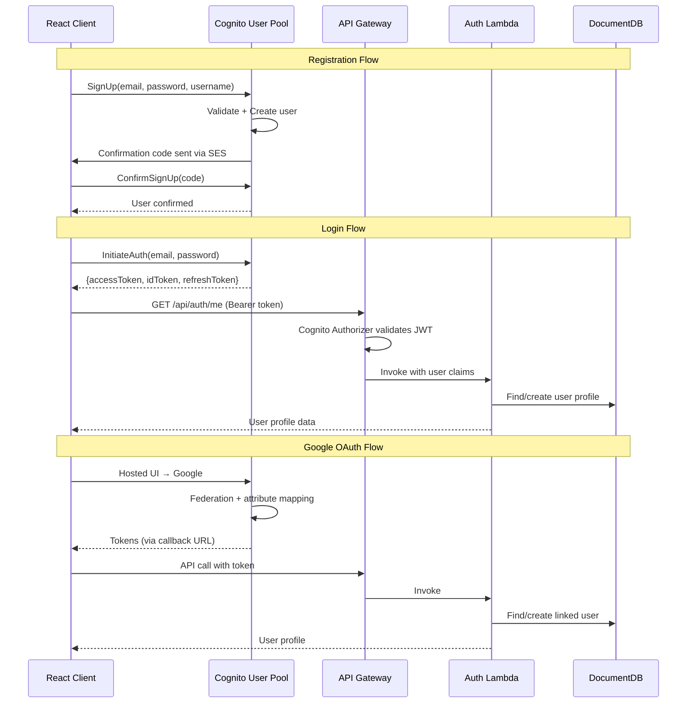
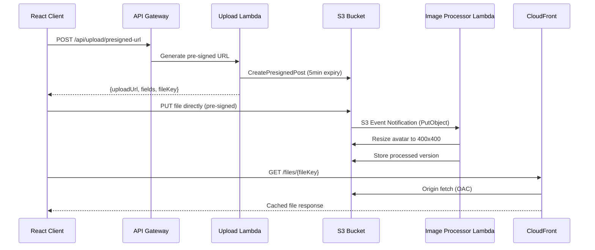
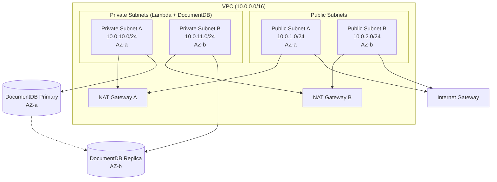
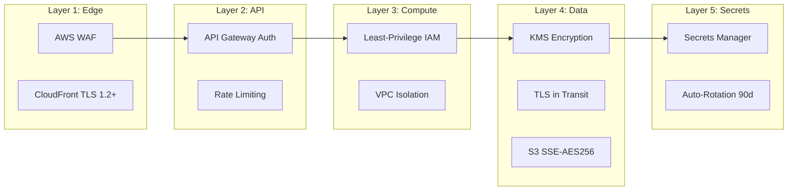
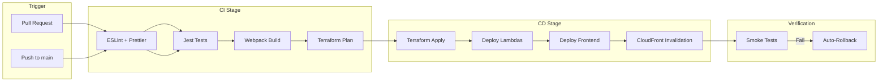
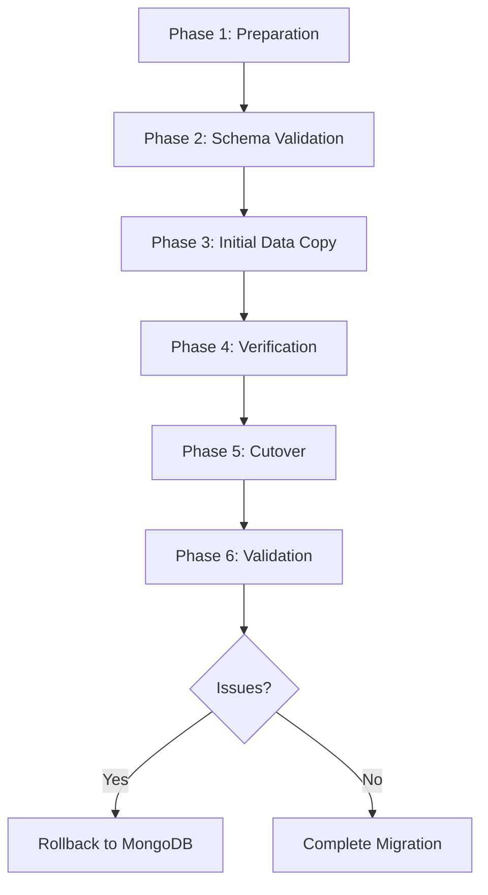

# Design Document: AWS Cloud-Native Migration

## Overview

This design document describes the architecture for migrating the Taskly project/task management application from a monolithic Docker/PM2 deployment to a serverless-first AWS architecture. The migration preserves all existing functionality while leveraging AWS managed services for automatic scaling, high availability, and cost efficiency.

The current system is a Node.js/Express backend with Mongoose ODM, React (Vite) frontend with Tailwind CSS, MongoDB database, JWT auth with Passport.js, Cloudinary file uploads, and Resend/Nodemailer for emails. The target architecture replaces each component with its AWS-native equivalent while maintaining API compatibility.

### Design Decisions and Rationale

| Decision | Choice | Rationale |
|----------|--------|-----------|
| Compute | Lambda + API Gateway HTTP API | Zero-cost idle, auto-scaling, pay-per-request pricing ideal for startup traffic |
| Database | DocumentDB | MongoDB wire-protocol compatible, preserves Mongoose ODM code, managed HA |
| Auth | Cognito | Managed OAuth, MFA, token lifecycle; reduces custom auth code |
| IaC | Terraform | Multi-cloud flexibility, mature ecosystem, state management |
| CI/CD | GitHub Actions | Already in use, native AWS integration via OIDC |
| Event Processing | EventBridge + SQS | Decouples async work, built-in retry/DLQ, event filtering |

## Architecture

### High-Level Architecture Diagram

```mermaid
graph TB
    subgraph "Client Layer"
        Browser[React SPA]
        Mobile[Mobile Client]
    end

    subgraph "Edge Layer"
        CF_Frontend[CloudFront<br/>Frontend Distribution]
        CF_Assets[CloudFront<br/>Asset Distribution]
        WAF[AWS WAF]
    end

    subgraph "API Layer"
        APIGW[API Gateway HTTP API]
        CognitoAuth[Cognito Authorizer]
    end

    subgraph "Compute Layer"
        LambdaAuth[Lambda: Auth]
        LambdaUsers[Lambda: Users]
        LambdaTasks[Lambda: Tasks]
        LambdaProjects[Lambda: Projects]
        LambdaTeams[Lambda: Teams]
        LambdaInvitations[Lambda: Invitations]
        LambdaNotifications[Lambda: Notifications]
        LambdaSearch[Lambda: Search]
        LambdaCalendar[Lambda: Calendar]
        LambdaUpload[Lambda: Upload]
        LambdaHealth[Lambda: Health]
        LambdaEvents[Lambda: Event Processor]
        LambdaEmail[Lambda: Email Sender]
        LambdaImageProc[Lambda: Image Processor]
    end

    subgraph "Event Layer"
        EventBridge[EventBridge Bus]
        SQS_Email[SQS: Email Queue]
        SQS_Notifications[SQS: Notification Queue]
        SQS_DLQ[SQS: Dead Letter Queue]
    end

    subgraph "Data Layer"
        DocDB[(DocumentDB Cluster)]
        S3_Uploads[S3: File Uploads]
        S3_Frontend[S3: Frontend Assets]
    end

    subgraph "Security & Config"
        Cognito[Cognito User Pool]
        SecretsManager[Secrets Manager]
        KMS[AWS KMS]
    end

    subgraph "Observability"
        CW_Logs[CloudWatch Logs]
        CW_Metrics[CloudWatch Metrics]
        CW_Alarms[CloudWatch Alarms]
        CW_Dashboard[CloudWatch Dashboard]
    end

    subgraph "Network"
        VPC[VPC]
        PrivateSubnets[Private Subnets]
        NATGateway[NAT Gateway]
    end

    Browser --> CF_Frontend
    Browser --> WAF
    Mobile --> WAF
    WAF --> APIGW
    CF_Frontend --> S3_Frontend
    CF_Assets --> S3_Uploads

    APIGW --> CognitoAuth
    CognitoAuth --> Cognito
    APIGW --> LambdaAuth
    APIGW --> LambdaUsers
    APIGW --> LambdaTasks
    APIGW --> LambdaProjects
    APIGW --> LambdaTeams
    APIGW --> LambdaInvitations
    APIGW --> LambdaNotifications
    APIGW --> LambdaSearch
    APIGW --> LambdaCalendar
    APIGW --> LambdaUpload
    APIGW --> LambdaHealth

    LambdaTasks --> EventBridge
    LambdaProjects --> EventBridge
    LambdaTeams --> EventBridge
    EventBridge --> SQS_Email
    EventBridge --> SQS_Notifications
    SQS_Email --> LambdaEmail
    SQS_Notifications --> LambdaEvents
    LambdaEvents --> SQS_DLQ

    LambdaAuth & LambdaUsers & LambdaTasks & LambdaProjects --> DocDB
    LambdaTeams & LambdaInvitations & LambdaNotifications & LambdaSearch --> DocDB
    DocDB --> PrivateSubnets
    PrivateSubnets --> VPC

    LambdaUpload --> S3_Uploads
    S3_Uploads --> LambdaImageProc
    LambdaEmail --> SES[Amazon SES]

    LambdaAuth & LambdaUsers & LambdaTasks --> SecretsManager
    SecretsManager --> KMS
    DocDB --> KMS

    LambdaAuth & LambdaUsers & LambdaTasks --> CW_Logs
    CW_Logs --> CW_Metrics
    CW_Metrics --> CW_Alarms
    CW_Alarms --> CW_Dashboard


### Request Flow Diagram

```mermaid
sequenceDiagram
    participant Client as React Client
    participant CF as CloudFront
    participant WAF as AWS WAF
    participant APIGW as API Gateway
    participant Auth as Cognito Authorizer
    participant Lambda as Lambda Function
    participant DB as DocumentDB
    participant EB as EventBridge

    Client->>CF: HTTPS Request
    CF->>WAF: Forward to WAF
    WAF->>WAF: Rate limit + OWASP checks
    WAF->>APIGW: Pass if allowed
    APIGW->>Auth: Validate JWT
    Auth->>Auth: Verify Cognito token
    Auth-->>APIGW: Token valid
    APIGW->>Lambda: Invoke handler
    Lambda->>DB: Query/Mutate data
    DB-->>Lambda: Result
    Lambda->>EB: Publish async event (if needed)
    Lambda-->>APIGW: Response
    APIGW-->>Client: HTTP Response
```

## Components and Interfaces

### 1. API Gateway Configuration

API Gateway HTTP API (v2) is used for lower latency and cost compared to REST API (v1).

#### Route Configuration

| Route Prefix | Lambda Function | Auth Required | Description |
|---|---|---|---|
| `POST /api/auth/register` | auth-handler | No | User registration |
| `POST /api/auth/login` | auth-handler | No | User login |
| `POST /api/auth/logout` | auth-handler | Yes | User logout |
| `GET /api/auth/me` | auth-handler | Yes | Get current user |
| `GET /api/users/*` | users-handler | Yes | User operations |
| `PUT /api/users/*` | users-handler | Yes | Update user |
| `GET /api/tasks` | tasks-handler | Yes | List tasks |
| `POST /api/tasks` | tasks-handler | Yes | Create task |
| `PUT /api/tasks/:id` | tasks-handler | Yes | Update task |
| `DELETE /api/tasks/:id` | tasks-handler | Yes | Delete task |
| `GET /api/projects/*` | projects-handler | Yes | Project operations |
| `POST /api/projects` | projects-handler | Yes | Create project |
| `PUT /api/projects/:id` | projects-handler | Yes | Update project |
| `DELETE /api/projects/:id` | projects-handler | Yes | Delete project |
| `GET /api/teams/*` | teams-handler | Yes | Team operations |
| `POST /api/teams` | teams-handler | Yes | Create team |
| `PUT /api/teams/:id` | teams-handler | Yes | Update team |
| `GET /api/invitations/*` | invitations-handler | Yes | Invitation operations |
| `POST /api/invitations` | invitations-handler | Yes | Create invitation |
| `GET /api/notifications/*` | notifications-handler | Yes | Notification operations |
| `GET /api/search` | search-handler | Yes | Search |
| `GET /api/calendar/*` | calendar-handler | Yes | Calendar operations |
| `POST /api/upload/*` | upload-handler | Yes | File upload |
| `GET /api/health` | health-handler | No | Health check |


#### API Gateway Settings

- **Protocol**: HTTP API (v2)
- **CORS**: Configured at gateway level (origins: CloudFront domain, localhost for dev)
- **Throttling**: 1000 requests/second burst, 500 requests/second steady-state
- **Timeout**: 29 seconds (Lambda max for synchronous invocation)
- **Payload limit**: 10MB (matches current Express body parser limit)
- **Stage**: `$default` with auto-deploy enabled

### 2. Lambda Function Structure

Each Lambda function is organized as a self-contained module handling a group of related routes.

```
backend/
├── src/
│   ├── handlers/
│   │   ├── auth.js          # POST /api/auth/*
│   │   ├── users.js         # /api/users/*
│   │   ├── tasks.js         # /api/tasks/*
│   │   ├── projects.js      # /api/projects/*
│   │   ├── teams.js         # /api/teams/*
│   │   ├── invitations.js   # /api/invitations/*
│   │   ├── notifications.js # /api/notifications/*
│   │   ├── search.js        # /api/search/*
│   │   ├── calendar.js      # /api/calendar/*
│   │   ├── upload.js        # /api/upload/*
│   │   ├── health.js        # GET /api/health
│   │   ├── eventProcessor.js # EventBridge consumer
│   │   └── emailSender.js   # SQS email consumer
│   ├── middleware/
│   │   ├── auth.js          # Token validation helpers
│   │   ├── validation.js    # Input validation (Joi)
│   │   └── errorHandler.js  # Structured error responses
│   ├── models/              # Mongoose models (unchanged)
│   │   ├── User.js
│   │   ├── Task.js
│   │   ├── Project.js
│   │   ├── Team.js
│   │   ├── Notification.js
│   │   ├── Invitation.js
│   │   └── Achievement.js
│   ├── services/
│   │   ├── database.js      # DocumentDB connection pooling
│   │   ├── events.js        # EventBridge publish helper
│   │   ├── storage.js       # S3 pre-signed URL generation
│   │   ├── email.js         # SES email sending
│   │   └── secrets.js       # Secrets Manager retrieval + caching
│   └── utils/
│       ├── response.js      # Standardized API responses
│       ├── logger.js        # Structured JSON logging
│       └── correlationId.js # Request correlation tracking
├── layers/
│   └── shared/              # Lambda Layer for shared dependencies
│       ├── nodejs/
│       │   └── node_modules/ # mongoose, joi, date-fns
│       └── package.json
├── package.json
└── webpack.config.js        # Bundle optimization
```


#### Lambda Function Configuration

| Function | Memory | Timeout | Architecture | Trigger |
|----------|--------|---------|--------------|---------|
| auth-handler | 256MB | 10s | arm64 | API Gateway |
| users-handler | 256MB | 10s | arm64 | API Gateway |
| tasks-handler | 256MB | 15s | arm64 | API Gateway |
| projects-handler | 256MB | 15s | arm64 | API Gateway |
| teams-handler | 256MB | 10s | arm64 | API Gateway |
| invitations-handler | 256MB | 10s | arm64 | API Gateway |
| notifications-handler | 256MB | 10s | arm64 | API Gateway |
| search-handler | 512MB | 15s | arm64 | API Gateway |
| calendar-handler | 256MB | 10s | arm64 | API Gateway |
| upload-handler | 512MB | 29s | arm64 | API Gateway |
| health-handler | 128MB | 5s | arm64 | API Gateway |
| event-processor | 256MB | 60s | arm64 | EventBridge/SQS |
| email-sender | 128MB | 30s | arm64 | SQS |
| image-processor | 512MB | 60s | arm64 | S3 Event |

#### Database Connection Management

Lambda functions reuse database connections across warm invocations:

```javascript
// src/services/database.js
import mongoose from 'mongoose';

let cachedConnection = null;

export async function connectToDatabase() {
  if (cachedConnection && mongoose.connection.readyState === 1) {
    return cachedConnection;
  }

  const uri = await getSecret('taskly/documentdb-uri');
  
  cachedConnection = await mongoose.connect(uri, {
    maxPoolSize: 2,          // Low pool for Lambda
    serverSelectionTimeoutMS: 5000,
    socketTimeoutMS: 45000,
    tls: true,
    tlsCAFile: '/opt/rds-combined-ca-bundle.pem',
    retryWrites: false,      // DocumentDB limitation
  });

  return cachedConnection;
}
```

### 3. Cognito Authentication Design

#### User Pool Configuration

- **Sign-in attributes**: email, username
- **Password policy**: Minimum 6 characters (matching current Taskly rules)
- **MFA**: Optional (future enhancement)
- **Email verification**: Required
- **Account recovery**: Email-based code verification

#### Identity Provider Federation

- **Google OAuth**: Configured as Cognito Identity Provider
- **Attribute mapping**: Google `sub` → Cognito `username`, `email` → `email`, `name` → `name`

#### Token Configuration

- **Access token**: 1 hour expiry
- **ID token**: 1 hour expiry
- **Refresh token**: 7 days expiry

#### Auth Flow Diagram




### 4. File Storage (S3 + CloudFront)

#### Upload Flow



#### S3 Bucket Structure

```
taskly-uploads-{env}/
├── avatars/
│   ├── {userId}/original/{filename}
│   └── {userId}/processed/{filename}
├── attachments/
│   └── {taskId}/{filename}
└── temp/
    └── {uploadId}/{filename}
```

#### S3 Lifecycle Rules

| Rule | Prefix | Transition | Days |
|------|--------|-----------|------|
| Move to IA | `attachments/` | Standard → IA | 90 |
| Clean temp | `temp/` | Delete | 1 |
| Abort multipart | All | AbortIncompleteMultipartUpload | 1 |

### 5. Frontend Hosting (CloudFront + S3)

#### Distribution Configuration

- **Origin**: S3 bucket (private, OAC access)
- **Default root object**: `index.html`
- **Error pages**: 403/404 → `/index.html` (SPA routing)
- **Price class**: PriceClass_100 (NA + Europe)
- **SSL**: ACM certificate (custom domain)
- **Compression**: gzip + Brotli enabled
- **Cache behaviors**:
  - `/assets/*` → Cache 1 year (immutable, hashed filenames from Vite)
  - `/index.html` → Cache 0 (no-cache, must-revalidate)
  - `/*` → Cache 1 hour (default)

### 6. Email Service (SES)

#### Configuration

- **Sending identity**: Verified domain (taskly.app or similar)
- **DNS records**: SPF, DKIM (2048-bit), DMARC
- **Configuration set**: Tracking opens, bounces, complaints
- **Sending mode**: Production (out of sandbox)

#### Email Templates

Existing templates migrated to SES templates:

| Template | Trigger | Current Implementation |
|----------|---------|----------------------|
| Password Reset | User requests reset | Resend/Nodemailer |
| Team Invitation | User invited to team | Resend/Nodemailer |
| Notification Digest | Batch notifications | Resend/Nodemailer |
| Welcome Email | New registration | Cognito (auto) |

### 7. Asynchronous Event Processing

#### EventBridge Event Schema

```json
{
  "source": "taskly.api",
  "detail-type": "task.completed",
  "detail": {
    "taskId": "string",
    "userId": "string",
    "projectId": "string",
    "teamId": "string",
    "completedAt": "ISO8601",
    "metadata": {}
  }
}
```

#### Event Types and Rules

| Event | Source | Target | Purpose |
|-------|--------|--------|---------|
| `task.completed` | tasks-handler | event-processor | Update stats, check achievements |
| `task.assigned` | tasks-handler | email-sender | Notify assignee |
| `team.member.added` | teams-handler | event-processor | Update team stats |
| `team.member.removed` | teams-handler | event-processor | Cleanup |
| `invitation.created` | invitations-handler | email-sender | Send invitation email |
| `project.updated` | projects-handler | event-processor | Notify watchers |
| `notification.created` | event-processor | SQS notification queue | Batch processing |


#### SQS Queue Configuration

| Queue | Visibility Timeout | Retention | DLQ Max Receives |
|-------|-------------------|-----------|-----------------|
| taskly-email-queue | 60s | 4 days | 3 |
| taskly-notification-queue | 60s | 4 days | 3 |
| taskly-dlq | N/A | 14 days | N/A |

## Data Models

### Database Schema Mapping (MongoDB → DocumentDB)

DocumentDB is wire-protocol compatible with MongoDB 5.0. All existing Mongoose schemas transfer directly with these considerations:

#### Collection Mapping

| Collection | Documents (est.) | Indexes | DocumentDB Notes |
|-----------|-----------------|---------|-----------------|
| users | ~1,000 | text(fullname, username, email), unique(username), unique(email) | Full compatibility |
| tasks | ~10,000 | compound(user, status), compound(project, status), timestamps | `retryWrites: false` required |
| projects | ~500 | compound(team), compound(owner), compound(members.user) | Full compatibility |
| teams | ~100 | unique(inviteCode), compound(owner), compound(members.user) | Full compatibility |
| notifications | ~50,000 | compound(recipient, read, createdAt), TTL(expiresAt) | TTL indexes supported |
| invitations | ~1,000 | compound(invitee, status), compound(team, status), TTL(expiresAt) | TTL indexes supported |
| achievements | ~50 | unique(id), compound(category, rarity) | Full compatibility |

#### DocumentDB Limitations and Mitigations

| MongoDB Feature | DocumentDB Support | Mitigation |
|----------------|-------------------|------------|
| `retryWrites` | Not supported | Set `retryWrites: false` in connection string |
| `$text` search | Supported (limited) | Use DocumentDB text indexes; consider OpenSearch for advanced search |
| Change Streams | Supported | Available for event-driven patterns |
| Transactions | Supported (4.0+) | Multi-document transactions available |
| `$lookup` aggregation | Supported | Cross-collection joins work |
| TTL indexes | Supported | Notification/invitation expiry works |
| Unique indexes | Supported | Username/email uniqueness preserved |

#### Schema Adaptations

The User model requires a new field to link Cognito identity:

```javascript
// Addition to User schema for Cognito integration
{
  cognitoSub: {
    type: String,
    unique: true,
    sparse: true,  // Allow null for migration period
    index: true
  },
  authProvider: {
    type: String,
    enum: ['local', 'google'],
    default: 'local'
  }
}
```

### VPC and Network Architecture



#### Security Groups

| Security Group | Inbound | Outbound | Attached To |
|---------------|---------|----------|-------------|
| sg-lambda | None | All (0.0.0.0/0) | Lambda functions |
| sg-documentdb | TCP 27017 from sg-lambda | None | DocumentDB cluster |
| sg-vpc-endpoints | TCP 443 from sg-lambda | None | VPC Endpoints |

#### VPC Endpoints (to avoid NAT costs)

| Service | Endpoint Type | Purpose |
|---------|--------------|---------|
| S3 | Gateway | File operations without NAT |
| DynamoDB | Gateway | (Future use) |
| Secrets Manager | Interface | Secret retrieval |
| SQS | Interface | Queue operations |
| EventBridge | Interface | Event publishing |
| CloudWatch Logs | Interface | Log shipping |


## Infrastructure as Code (Terraform)

### Module Organization

```
terraform/
├── environments/
│   ├── dev/
│   │   ├── main.tf
│   │   ├── variables.tf
│   │   ├── terraform.tfvars
│   │   └── backend.tf
│   ├── staging/
│   │   ├── main.tf
│   │   ├── variables.tf
│   │   ├── terraform.tfvars
│   │   └── backend.tf
│   └── prod/
│       ├── main.tf
│       ├── variables.tf
│       ├── terraform.tfvars
│       └── backend.tf
├── modules/
│   ├── networking/
│   │   ├── main.tf          # VPC, subnets, NAT, IGW
│   │   ├── variables.tf
│   │   ├── outputs.tf
│   │   └── security-groups.tf
│   ├── database/
│   │   ├── main.tf          # DocumentDB cluster + instances
│   │   ├── variables.tf
│   │   └── outputs.tf
│   ├── compute/
│   │   ├── main.tf          # Lambda functions
│   │   ├── api-gateway.tf   # HTTP API + routes
│   │   ├── layers.tf        # Lambda layers
│   │   ├── variables.tf
│   │   └── outputs.tf
│   ├── auth/
│   │   ├── main.tf          # Cognito User Pool + Client
│   │   ├── identity-providers.tf
│   │   ├── variables.tf
│   │   └── outputs.tf
│   ├── storage/
│   │   ├── main.tf          # S3 buckets
│   │   ├── cloudfront.tf    # Distributions
│   │   ├── variables.tf
│   │   └── outputs.tf
│   ├── messaging/
│   │   ├── main.tf          # EventBridge + SQS
│   │   ├── ses.tf           # SES configuration
│   │   ├── variables.tf
│   │   └── outputs.tf
│   ├── security/
│   │   ├── main.tf          # WAF, KMS
│   │   ├── secrets.tf       # Secrets Manager
│   │   ├── iam.tf           # IAM roles + policies
│   │   ├── variables.tf
│   │   └── outputs.tf
│   ├── monitoring/
│   │   ├── main.tf          # CloudWatch dashboards
│   │   ├── alarms.tf        # Alarms + SNS
│   │   ├── log-groups.tf    # Log groups + retention
│   │   ├── variables.tf
│   │   └── outputs.tf
│   └── cicd/
│       ├── main.tf          # OIDC provider for GitHub Actions
│       ├── variables.tf
│       └── outputs.tf
├── shared/
│   ├── tags.tf              # Common tagging
│   └── providers.tf         # Provider configuration
└── scripts/
    ├── migrate-data.sh      # Data migration script
    └── rotate-secrets.sh    # Secret rotation helper
```

### Terraform State Management

- **Backend**: S3 bucket with DynamoDB locking
- **State file per environment**: Isolated blast radius
- **State bucket**: `taskly-terraform-state-{account-id}`
- **Lock table**: `taskly-terraform-locks`

### Resource Tagging Strategy

All resources tagged with:

```hcl
locals {
  common_tags = {
    Project     = "taskly"
    Environment = var.environment
    ManagedBy   = "terraform"
    CostCenter  = "engineering"
    Owner       = "platform-team"
  }
}
```

### Environment-Specific Configuration

| Parameter | Dev | Staging | Production |
|-----------|-----|---------|------------|
| DocumentDB instances | 1 (db.t3.medium) | 1 (db.t3.medium) | 2 (db.r5.large) |
| Lambda concurrency | 10 | 50 | 100 |
| CloudFront price class | PriceClass_100 | PriceClass_100 | PriceClass_100 |
| WAF rules | Basic | Full | Full |
| Log retention | 7 days | 14 days | 30 days |
| Backup retention | 1 day | 3 days | 7 days |
| NAT Gateways | 1 | 1 | 2 |
| VPC Endpoints | Minimal | Full | Full |


## Security Architecture

### Defense-in-Depth Layers



### WAF Rule Configuration

| Rule | Priority | Action | Description |
|------|----------|--------|-------------|
| AWS-AWSManagedRulesCommonRuleSet | 1 | Block | OWASP common attacks |
| AWS-AWSManagedRulesSQLiRuleSet | 2 | Block | SQL injection |
| AWS-AWSManagedRulesKnownBadInputsRuleSet | 3 | Block | Known bad patterns |
| RateLimit-PerIP | 4 | Block | 1000 req/5min per IP |
| GeoBlock (optional) | 5 | Block | Block specific countries |

### IAM Policy Design (Least Privilege)

Each Lambda function gets a dedicated IAM role with only required permissions:

```json
{
  "tasks-handler-role": {
    "Effect": "Allow",
    "Action": [
      "secretsmanager:GetSecretValue",
      "logs:CreateLogGroup",
      "logs:CreateLogStream",
      "logs:PutLogEvents",
      "events:PutEvents",
      "ec2:CreateNetworkInterface",
      "ec2:DescribeNetworkInterfaces",
      "ec2:DeleteNetworkInterface"
    ],
    "Resource": ["specific-ARNs-only"]
  }
}
```

### Secrets Management

| Secret | Rotation | Consumers |
|--------|----------|-----------|
| `taskly/documentdb-uri` | 90 days | All API Lambdas |
| `taskly/cognito-client-secret` | 90 days | auth-handler |
| `taskly/ses-smtp-credentials` | 90 days | email-sender |
| `taskly/google-oauth-secret` | Manual | auth-handler |
| `taskly/jwt-signing-key` | 90 days | auth-handler (legacy compat) |

## CI/CD Pipeline Design

### Pipeline Architecture



### GitHub Actions Workflow Structure

```yaml
# .github/workflows/deploy.yml (conceptual)
name: Deploy to AWS
on:
  push:
    branches: [main]
  pull_request:
    branches: [main]

jobs:
  lint-and-test:
    runs-on: ubuntu-latest
    steps:
      - Checkout
      - Install dependencies
      - Run ESLint
      - Run Jest tests
      - Upload coverage

  build:
    needs: lint-and-test
    if: github.event_name == 'push'
    runs-on: ubuntu-latest
    steps:
      - Build backend (webpack)
      - Build frontend (vite)
      - Upload artifacts

  deploy-infrastructure:
    needs: build
    runs-on: ubuntu-latest
    steps:
      - Configure AWS credentials (OIDC)
      - Terraform init
      - Terraform plan
      - Terraform apply

  deploy-backend:
    needs: deploy-infrastructure
    runs-on: ubuntu-latest
    strategy:
      matrix:
        function: [auth, users, tasks, projects, teams, ...]
    steps:
      - Download build artifacts
      - Update Lambda function code
      - Publish new version
      - Update alias (canary 10% → 100%)

  deploy-frontend:
    needs: deploy-infrastructure
    runs-on: ubuntu-latest
    steps:
      - Download build artifacts
      - Sync to S3 (with content-type headers)
      - Invalidate CloudFront (index.html only)

  smoke-test:
    needs: [deploy-backend, deploy-frontend]
    runs-on: ubuntu-latest
    steps:
      - Hit /api/health endpoint
      - Verify 200 response
      - Check frontend loads
      - On failure: rollback Lambda aliases
```


### Deployment Strategy

- **Lambda**: Canary deployment using aliases (10% traffic for 5 minutes, then 100%)
- **Frontend**: Atomic S3 sync + CloudFront invalidation
- **Infrastructure**: Terraform apply with auto-approve in CI (plan reviewed in PR)
- **Rollback**: Revert Lambda alias to previous version; frontend: re-sync previous build

### AWS Authentication for CI/CD

GitHub Actions authenticates to AWS using OIDC federation (no long-lived credentials):

```hcl
# Terraform: OIDC provider for GitHub Actions
resource "aws_iam_openid_connect_provider" "github" {
  url             = "https://token.actions.githubusercontent.com"
  client_id_list  = ["sts.amazonaws.com"]
  thumbprint_list = ["6938fd4d98bab03faadb97b34396831e3780aea1"]
}
```

## Monitoring and Observability

### CloudWatch Dashboard Widgets

| Widget | Metric | Period |
|--------|--------|--------|
| Request Volume | API Gateway request count | 5 min |
| Latency Distribution | Lambda duration p50/p95/p99 | 5 min |
| Error Rate | 4xx + 5xx / total requests | 5 min |
| Cold Starts | Lambda init duration > 0 | 5 min |
| DB Connections | DocumentDB connections | 1 min |
| DB CPU | DocumentDB CPU utilization | 1 min |
| Email Delivery | SES send/bounce/complaint | 1 hour |
| Cost Tracker | Estimated charges | 1 day |

### Alarm Configuration

| Alarm | Metric | Threshold | Period | Action |
|-------|--------|-----------|--------|--------|
| High Error Rate | 5xx count | > 5% of requests | 5 min | SNS → Email |
| High Latency | p99 duration | > 5000ms | 5 min | SNS → Email |
| Cold Start Warning | Init duration | > 3000ms | 5 min | SNS → Email |
| DB CPU Critical | CPU utilization | > 80% | 5 min | SNS → Email |
| DB Connections | Active connections | > 80% of max | 5 min | SNS → Email |
| DLQ Messages | ApproximateNumberOfMessages | > 0 | 1 min | SNS → Email |
| Budget Alert | EstimatedCharges | > $80 | 6 hours | SNS → Email |
| DocumentDB Failover | Failover event | Any | Immediate | SNS → Email |

### Structured Logging Format

```json
{
  "timestamp": "2024-01-15T10:30:00.000Z",
  "level": "INFO",
  "correlationId": "req-abc123",
  "service": "tasks-handler",
  "function": "createTask",
  "userId": "user-xyz",
  "duration": 145,
  "statusCode": 201,
  "message": "Task created successfully",
  "metadata": {
    "taskId": "task-456",
    "projectId": "proj-789"
  }
}
```

## Data Migration Strategy

### Migration Process



### Migration Steps

1. **Preparation** (1 hour)
   - Provision DocumentDB cluster
   - Configure VPC peering or VPN to source MongoDB
   - Create indexes in DocumentDB matching source
   - Test connectivity

2. **Schema Validation** (30 min)
   - Run compatibility check for all Mongoose schemas
   - Identify DocumentDB-incompatible features
   - Apply transformations (e.g., remove `retryWrites`)

3. **Initial Data Copy** (variable, ~30 min for 10GB)
   - Use `mongodump` from source MongoDB
   - Use `mongorestore` to DocumentDB
   - Alternatively: AWS Database Migration Service (DMS)

4. **Verification** (30 min)
   - Compare record counts per collection
   - Validate index creation
   - Run sample queries against both databases
   - Verify text search indexes work

5. **Cutover** (15 min maintenance window)
   - Set source MongoDB to read-only
   - Run final incremental sync
   - Update Lambda connection strings (via Secrets Manager)
   - Deploy updated Lambda functions

6. **Post-Migration Validation** (30 min)
   - Run full API test suite against DocumentDB
   - Verify all CRUD operations
   - Check aggregation pipelines
   - Monitor error rates

### Rollback Procedure

- Revert Secrets Manager to original MongoDB URI
- Redeploy Lambda functions (picks up old secret)
- Total rollback time: < 15 minutes


## Cost Estimation

### Monthly Cost Breakdown (Production, ~1000 DAU)

| Service | Configuration | Estimated Monthly Cost |
|---------|--------------|----------------------|
| Lambda | ~3M invocations, 256MB avg, arm64 | $8-12 |
| API Gateway | ~3M requests (HTTP API) | $3-4 |
| DocumentDB | 1x db.t3.medium + 1x replica | $45-55 |
| S3 | 50GB storage + requests | $2-3 |
| CloudFront | 100GB transfer, 5M requests | $10-15 |
| Cognito | 1000 MAU (free tier) | $0 |
| SES | 10,000 emails/month | $1 |
| EventBridge | 1M events | $1 |
| SQS | 1M messages | $0.40 |
| Secrets Manager | 5 secrets | $2 |
| CloudWatch | Logs + metrics + alarms | $5-8 |
| WAF | 1 Web ACL + managed rules | $7-10 |
| NAT Gateway | 1 gateway + data processing | $35-45 |
| VPC Endpoints | 4 interface endpoints | $28-35 |
| **Total** | | **$147-190** |

### Cost Optimization Strategies

1. **NAT Gateway alternatives**: Use VPC endpoints for AWS services to reduce NAT data processing charges
2. **Single NAT in dev/staging**: Only use multi-AZ NAT in production
3. **DocumentDB scaling**: Start with single instance in dev, add replica only for production
4. **Lambda Provisioned Concurrency**: Only if cold starts become a user-facing issue
5. **Reserved capacity**: Consider DocumentDB reserved instances after 6 months of stable usage
6. **S3 Intelligent-Tiering**: Automatic cost optimization for infrequently accessed files

### Cost Reduction Path to <$100/month

| Optimization | Savings |
|-------------|---------|
| Remove 1 NAT Gateway (single-AZ in prod) | -$35 |
| Reduce VPC endpoints (use NAT for some) | -$14 |
| Single DocumentDB instance (accept lower HA) | -$25 |
| **Optimized Total** | **~$75-95** |

> **Note**: The <$100/month target is achievable by accepting single-AZ for DocumentDB in early stages and minimizing VPC endpoints. As traffic grows, scale up infrastructure.

## Error Handling

### Error Response Format

All Lambda functions return standardized error responses:

```json
{
  "success": false,
  "error": {
    "message": "Human-readable error message",
    "code": "VALIDATION_ERROR",
    "correlationId": "req-abc123",
    "details": {}
  }
}
```

### Error Categories and HTTP Status Codes

| Category | HTTP Status | Code | Retry |
|----------|-------------|------|-------|
| Validation | 400 | VALIDATION_ERROR | No |
| Authentication | 401 | UNAUTHORIZED | No |
| Authorization | 403 | FORBIDDEN | No |
| Not Found | 404 | NOT_FOUND | No |
| Conflict | 409 | CONFLICT | No |
| Rate Limited | 429 | RATE_LIMITED | Yes (backoff) |
| Internal Error | 500 | INTERNAL_ERROR | Yes |
| Service Unavailable | 503 | SERVICE_UNAVAILABLE | Yes |
| Gateway Timeout | 504 | GATEWAY_TIMEOUT | Yes |

### Retry and Circuit Breaker Strategy

- **Database connection**: Retry 3 times with exponential backoff (100ms, 200ms, 400ms)
- **Secrets Manager**: Cache secrets for 5 minutes, retry on cache miss
- **EventBridge publish**: Fire-and-forget with DLQ for failures
- **SQS processing**: Automatic retry via visibility timeout, DLQ after 3 failures
- **S3 operations**: AWS SDK built-in retry (3 attempts)

### Dead Letter Queue Processing

Failed async events land in the DLQ. Operations team:
1. Reviews DLQ messages via CloudWatch alarm
2. Identifies root cause (schema change, service outage, bug)
3. Fixes issue and replays messages using a replay Lambda
4. Messages older than 14 days are automatically purged

## Testing Strategy

### Testing Approach

This migration is primarily an infrastructure project (IaC with Terraform, AWS service configuration, CI/CD pipelines). Property-based testing is **not applicable** because:

- Terraform modules are declarative configuration, not functions with variable inputs
- AWS service integrations are tested via integration tests against real/mocked services
- The migration preserves existing business logic (already tested) and wraps it in Lambda handlers

### Test Categories

#### 1. Unit Tests (Jest)

Test the Lambda handler logic, middleware, and service layer:

- **Handler tests**: Verify request parsing, response formatting, error handling
- **Service tests**: Test database connection management, secret caching, event publishing
- **Middleware tests**: Validate input validation, auth token extraction
- **Coverage target**: 80% for handler and service code

#### 2. Integration Tests

Test AWS service interactions with real or mocked services:

- **LocalStack**: Mock AWS services (S3, SQS, EventBridge, Secrets Manager) locally
- **DocumentDB**: Test against a local MongoDB instance (wire-compatible)
- **API Gateway**: Test route configuration with `aws-sdk` client
- **Cognito**: Mock token validation in tests

#### 3. Infrastructure Tests

Validate Terraform modules produce correct configurations:

- **`terraform plan`**: Verify no unexpected changes in CI
- **`terraform validate`**: Syntax and reference checking
- **tflint**: Terraform linting for best practices
- **Checkov/tfsec**: Security scanning for IaC misconfigurations
- **Module output tests**: Verify outputs contain expected ARNs/URLs

#### 4. End-to-End Tests

Post-deployment verification:

- **Smoke tests**: Hit `/api/health`, verify frontend loads
- **API contract tests**: Run existing Supertest suite against deployed API
- **Auth flow tests**: Register → Login → Access protected route
- **File upload tests**: Upload → Process → Retrieve via CloudFront

#### 5. Data Migration Tests

- **Record count validation**: Source vs destination per collection
- **Index verification**: All indexes created successfully
- **Query compatibility**: Run representative queries against DocumentDB
- **Performance comparison**: Latency benchmarks vs source MongoDB

### Test Execution in CI/CD

```
PR opened:
  → lint → unit tests → terraform validate → terraform plan (comment on PR)

Push to main:
  → lint → unit tests → build → terraform apply → deploy → smoke tests
  → On failure: auto-rollback + alert
```
