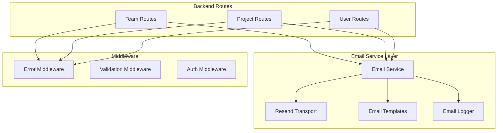

# Bug Fixes and Email Migration Design Document

## Overview

This design document outlines the approach for fixing all remaining bugs in the team collaboration and project management features, and migrating the email service from Nodemailer to Resend. The work focuses on ensuring stability, reliability, and proper error handling throughout the application while improving email deliverability.

## Architecture

### Current Issues Identified

Based on code analysis and fix documentation, the following issues have been identified:

1. **Email Service**: Currently using Nodemailer with Gmail SMTP, which has limitations and reliability issues
2. **Error Response Inconsistency**: Some routes return inconsistent error formats
3. **Member Management**: Edge cases in member removal and role updates
4. **Permission Checks**: Some permission validations could be more robust
5. **Data Population**: Inconsistent population of related data across routes

### Proposed Architecture Changes



## Components and Interfaces

### 1. Resend Email Service

**File**: `backend/config/resend.js`

```javascript
import { Resend } from 'resend';

const resend = new Resend(process.env.RESEND_API_KEY);

export const sendEmail = async ({ to, subject, html }) => {
  if (!process.env.RESEND_API_KEY) {
    console.warn('   Resend API key not configured');
    return { success: false, message: 'Email service not configured' };
  }

  try {
    const data = await resend.emails.send({
      from: process.env.EMAIL_FROM || 'Taskly <onboarding@resend.dev>',
      to,
      subject,
      html,
    });

    console.log('  Email sent via Resend:', data.id);
    return { success: true, id: data.id };
  } catch (error) {
    console.error('❌ Resend error:', error);
    return { success: false, error: error.message };
  }
};

export default sendEmail;
```

### 2. Enhanced Error Handling Middleware

**File**: `backend/middleware/errorHandler.js`

```javascript
export const errorHandler = (err, req, res, next) => {
  console.error('Error:', err);

  // Default error response
  const errorResponse = {
    success: false,
    error: {
      message: err.message || 'Internal server error',
      code: err.code || 'INTERNAL_ERROR',
      ...(process.env.NODE_ENV === 'development' && { stack: err.stack })
    }
  };

  // Handle specific error types
  if (err.name === 'ValidationError') {
    errorResponse.error.code = 'VALIDATION_ERROR';
    errorResponse.error.details = Object.values(err.errors).map(e => e.message);
    return res.status(400).json(errorResponse);
  }

  if (err.name === 'CastError') {
    errorResponse.error.message = 'Invalid ID format';
    errorResponse.error.code = 'INVALID_ID';
    return res.status(400).json(errorResponse);
  }

  if (err.code === 11000) {
    errorResponse.error.message = 'Duplicate key error';
    errorResponse.error.code = 'DUPLICATE_KEY';
    return res.status(409).json(errorResponse);
  }

  const statusCode = err.statusCode || 500;
  res.status(statusCode).json(errorResponse);
};
```

### 3. Consistent Response Utilities

**File**: `backend/utils/response.js`

```javascript
export const successResponse = (res, data, message, statusCode = 200) => {
  return res.status(statusCode).json({
    success: true,
    data,
    message
  });
};

export const errorResponse = (res, message, code, statusCode = 500, details = null) => {
  const response = {
    success: false,
    error: {
      message,
      code
    }
  };

  if (details) {
    response.error.details = details;
  }

  return res.status(statusCode).json(response);
};
```

## Data Models

### Email Configuration

```javascript
// Environment variables required
RESEND_API_KEY=re_xxxxxxxxxxxxx
EMAIL_FROM=Taskly <noreply@yourdomain.com>
CLIENT_URL=http://localhost:3000
```

### Error Response Format

All API responses will follow this consistent format:

```javascript
// Success Response
{
  success: true,
  data: { ... },
  message: "Operation completed successfully"
}

// Error Response
{
  success: false,
  error: {
    message: "Error description",
    code: "ERROR_CODE",
    details: [] // Optional array of detailed errors
  }
}
```

## Error Handling

### Backend Error Handling Strategy

1. **Route-Level Error Handling**
   - Wrap all async route handlers with try-catch
   - Use consistent error response format
   - Log errors with appropriate context

2. **Middleware Error Handling**
   - Centralized error handler middleware
   - Handle specific error types (validation, cast, duplicate key)
   - Provide appropriate HTTP status codes

3. **Email Service Error Handling**
   - Graceful degradation when email service unavailable
   - Log email failures without breaking application flow
   - Return success even if email fails (for non-critical emails)

### Frontend Error Handling Strategy

1. **API Error Handling**
   - Parse error responses consistently
   - Display user-friendly error messages
   - Log errors for debugging

2. **UI Error Boundaries**
   - Catch React component errors
   - Display fallback UI
   - Allow recovery without full page reload

## Testing Strategy

### Unit Testing

**Backend Tests**
- Email service with mocked Resend API
- Error handling middleware
- Response utility functions
- Route handlers with various error scenarios

**Frontend Tests**
- Error display components
- API error handling
- Form validation

### Integration Testing

**Email Flow Tests**
- Password reset email flow
- Team invitation email flow
- Email service fallback behavior

**Error Handling Tests**
- Invalid input handling
- Permission denial scenarios
- Database error scenarios

### Manual Testing Checklist

**Team Features**
- [ ] Create team
- [ ] Update team settings
- [ ] Add/remove members
- [ ] Change member roles
- [ ] Generate/regenerate invite codes
- [ ] Join team with invite code
- [ ] Delete team

**Project Features**
- [ ] Create project
- [ ] Update project settings
- [ ] Add/remove members
- [ ] Change member roles
- [ ] View project statistics
- [ ] Delete project

**Email Features**
- [ ] Password reset email
- [ ] Team invitation email
- [ ] Email service graceful degradation

## Implementation Plan

### Phase 1: Email Service Migration

1. Install Resend package
2. Create new Resend email service
3. Update email templates for Resend
4. Replace Nodemailer calls with Resend
5. Update environment configuration
6. Test email delivery

### Phase 2: Error Handling Improvements

1. Create centralized error handler middleware
2. Create response utility functions
3. Update all routes to use consistent error responses
4. Add error logging
5. Test error scenarios

### Phase 3: Bug Fixes

1. Fix member management edge cases
2. Improve permission checks
3. Ensure consistent data population
4. Fix UI issues
5. Test all fixed scenarios

### Phase 4: Testing and Validation

1. Run unit tests
2. Run integration tests
3. Perform manual testing
4. Fix any discovered issues
5. Document changes

## Security Considerations

### Email Security

- Store Resend API key securely in environment variables
- Validate email addresses before sending
- Rate limit email sending to prevent abuse
- Use verified sender domains in production

### Permission Security

- Always verify user permissions before operations
- Check both team and project membership
- Validate role hierarchies
- Prevent privilege escalation

### Data Security

- Sanitize all user inputs
- Validate MongoDB ObjectIds
- Prevent injection attacks
- Use parameterized queries

## Performance Considerations

### Email Performance

- Send emails asynchronously
- Don't block API responses waiting for email
- Implement email queue for high volume (future enhancement)
- Cache email templates

### Database Performance

- Use indexes for frequently queried fields
- Limit population depth
- Use lean queries where appropriate
- Implement pagination for large datasets

## Migration Strategy

### Nodemailer to Resend Migration

1. **Preparation**
   - Sign up for Resend account
   - Verify sender domain
   - Get API key
   - Test in development

2. **Implementation**
   - Install Resend package
   - Create new email service
   - Update all email sending code
   - Keep Nodemailer as fallback initially

3. **Testing**
   - Test all email flows in development
   - Verify email delivery
   - Check email formatting
   - Test error scenarios

4. **Deployment**
   - Update production environment variables
   - Deploy new code
   - Monitor email delivery
   - Remove Nodemailer dependency

### Rollback Plan

If issues occur with Resend:
1. Revert to Nodemailer configuration
2. Update environment variables
3. Redeploy previous version
4. Investigate and fix issues
5. Retry migration

## Monitoring and Logging

### Email Monitoring

- Log all email send attempts
- Track success/failure rates
- Monitor Resend API usage
- Alert on email failures

### Error Monitoring

- Log all application errors
- Track error rates by endpoint
- Monitor error types
- Alert on critical errors

### Performance Monitoring

- Track API response times
- Monitor database query performance
- Track email send times
- Monitor resource usage

## Documentation Updates

### Environment Variables

Update `.env.example` with:
```bash
# Resend Email Service
RESEND_API_KEY=your_resend_api_key
EMAIL_FROM=Taskly <noreply@yourdomain.com>
```

### API Documentation

Update API documentation to reflect:
- Consistent error response format
- New email service behavior
- Updated error codes
- Permission requirements

### Deployment Guide

Update deployment documentation with:
- Resend account setup
- Domain verification steps
- Environment variable configuration
- Testing procedures

## Success Criteria

### Email Migration Success

- [ ] All emails sent via Resend
- [ ] Email delivery rate > 95%
- [ ] No email-related errors in logs
- [ ] All email templates working correctly

### Bug Fix Success

- [ ] All identified bugs fixed
- [ ] No regression in existing features
- [ ] All tests passing
- [ ] No console errors in browser

### Error Handling Success

- [ ] Consistent error responses across all endpoints
- [ ] User-friendly error messages
- [ ] Proper HTTP status codes
- [ ] Errors logged appropriately

## Future Enhancements

### Email Enhancements

- Email queue for high volume
- Email templates in database
- Email preferences per user
- Email analytics dashboard

### Error Handling Enhancements

- Error tracking service integration (Sentry)
- Error rate alerting
- Automatic error recovery
- Error analytics

### Testing Enhancements

- Automated E2E tests
- Performance testing
- Load testing
- Security testing

This design provides a comprehensive approach to fixing bugs and migrating to Resend while maintaining system stability and improving overall reliability.
