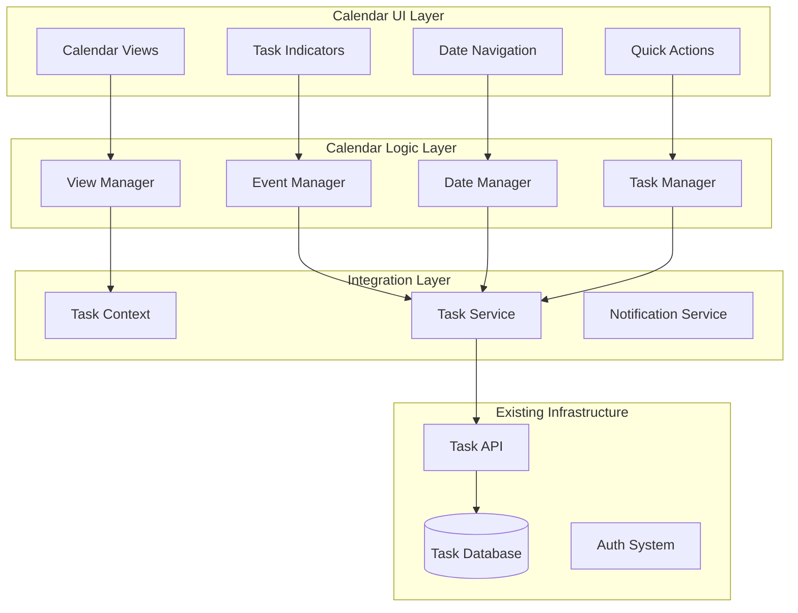

# Calendar Functionality Design Document

## Overview

The Calendar Functionality will transform Taskly's existing placeholder calendar page into a comprehensive task visualization and management system. This design leverages the existing task management infrastructure, date-fns library, and UI components while creating an intuitive calendar interface that seamlessly integrates with the current workflow.

The system will provide multiple calendar views (month, week, day, agenda) with drag-and-drop functionality, visual task indicators, and direct task management capabilities, enhancing user productivity through better schedule visualization.

## Architecture

### High-Level Architecture



### Component Architecture

The calendar system will integrate with existing components while adding new calendar-specific functionality:

- **Calendar Views**: Month, week, day, and agenda view components
- **Task Integration**: Enhanced task components for calendar context
- **Date Utilities**: Centralized date formatting and manipulation
- **Event Handling**: Drag-and-drop, click handlers, and keyboard navigation

## Components and Interfaces

### Core Calendar Components

#### 1. Calendar Container Components

**Calendar.jsx** (Enhanced existing component)
- Main calendar page container
- View mode management and state
- Integration with existing layout patterns
- Responsive design for mobile and desktop

**CalendarHeader.jsx**
- Date navigation controls (prev/next, today button)
- View mode selector (month/week/day/agenda)
- Current date display and quick date picker
- Calendar actions (create task, filter, settings)

**CalendarGrid.jsx**
- Main calendar grid layout
- Date cell rendering and event handling
- Task indicator positioning and display
- Drag-and-drop zone management

#### 2. Calendar View Components

**MonthView.jsx**
- 6-week grid layout with date cells
- Task indicators with priority colors
- Multi-task display and overflow handling
- Click and hover event management

**WeekView.jsx**
- 7-day horizontal layout with time slots
- Hourly grid for detailed scheduling
- Task duration visualization
- Time-based task positioning

**DayView.jsx**
- Single day detailed view
- Hourly timeline with task blocks
- Task duration and overlap handling
- Detailed task information display

**AgendaView.jsx**
- Chronological list of upcoming tasks
- Grouped by date with expandable sections
- Task status and priority indicators
- Quick task actions and editing

#### 3. Task Integration Components

**CalendarTaskCard.jsx**
- Task display within calendar cells
- Priority color coding and status indicators
- Hover tooltips with task details
- Click handlers for task editing

**TaskQuickCreate.jsx**
- Modal for quick task creation from calendar
- Pre-filled date from calendar selection
- Simplified form with essential fields
- Integration with existing task creation flow

**TaskDragPreview.jsx**
- Visual feedback during drag operations
- Task information display while dragging
- Drop zone highlighting and validation
- Drag cancellation and error handling

#### 4. Navigation and Utility Components

**DateNavigator.jsx**
- Previous/next navigation buttons
- Today button with current date highlighting
- Date range display for current view
- Keyboard navigation support

**CalendarDatePicker.jsx**
- Quick date selection modal
- Month/year picker interface
- Integration with date-fns utilities
- Accessibility and keyboard support

**CalendarFilters.jsx**
- Task filtering options for calendar view
- Priority, status, and tag filters
- Integration with existing filter system
- Filter state persistence

### Enhanced Existing Components

#### Task Management Integration

**TaskForm.jsx** (Enhanced)
- Calendar context awareness
- Date selection with calendar widget
- Time picker for precise scheduling
- Recurring task configuration

**TaskCard.jsx** (Enhanced)
- Calendar view mode detection
- Compact display for calendar cells
- Quick actions for calendar context
- Drag handle for calendar operations

**TaskList.jsx** (Enhanced)
- Calendar view toggle option
- Date-based grouping and sorting
- Integration with calendar filters
- Synchronized selection state

### Data Models and Interfaces

#### Calendar State Structure

```javascript
const calendarState = {
  // View configuration
  currentView: 'month' | 'week' | 'day' | 'agenda',
  currentDate: Date,
  selectedDate: Date,
  dateRange: {
    start: Date,
    end: Date
  },
  
  // Task data organized by date
  tasksByDate: {
    [dateString]: [Task]
  },
  
  // UI state
  isLoading: boolean,
  draggedTask: Task | null,
  selectedTasks: [taskId],
  filters: {
    priority: [string],
    status: [string],
    tags: [string]
  },
  
  // Settings
  settings: {
    weekStartsOn: 0 | 1, // Sunday or Monday
    timeFormat: '12h' | '24h',
    showWeekends: boolean,
    defaultView: string,
    reminderSettings: {
      enabled: boolean,
      defaultReminder: number // minutes before
    }
  }
}
```

#### Calendar Event Interface

```javascript
const CalendarEvent = {
  id: string,
  title: string,
  description: string,
  startDate: Date,
  endDate: Date,
  allDay: boolean,
  priority: 'low' | 'medium' | 'high',
  status: 'in-progress' | 'completed' | 'failed',
  tags: [string],
  category: string,
  recurring: {
    enabled: boolean,
    pattern: 'daily' | 'weekly' | 'monthly',
    interval: number,
    endDate: Date
  },
  reminders: [{
    time: number, // minutes before
    method: 'notification' | 'email'
  }]
}
```

### Date Utilities and Helpers

#### Centralized Date Management

**dateUtils.js**
```javascript
// Centralized date formatting and manipulation
export const dateUtils = {
  // Format dates for different contexts
  formatCalendarDate: (date) => format(date, 'yyyy-MM-dd'),
  formatDisplayDate: (date) => format(date, 'MMM d, yyyy'),
  formatTimeSlot: (date) => format(date, 'h:mm a'),
  
  // Calendar navigation
  getMonthRange: (date) => ({ start, end }),
  getWeekRange: (date) => ({ start, end }),
  getDayRange: (date) => ({ start, end }),
  
  // Task date operations
  isTaskDueToday: (task) => boolean,
  isTaskOverdue: (task) => boolean,
  getTasksForDate: (tasks, date) => [Task],
  
  // Calendar grid helpers
  getCalendarGrid: (date) => [[Date]],
  getWeekDays: (startDate) => [Date],
  getTimeSlots: (startHour, endHour) => [string]
}
```

#### Task Calendar Integration

**taskCalendarUtils.js**
```javascript
// Task-specific calendar utilities
export const taskCalendarUtils = {
  // Task positioning and display
  getTaskPosition: (task, view) => ({ x, y, width, height }),
  getTaskColor: (task) => string,
  getTaskIndicator: (task) => ReactElement,
  
  // Task operations
  updateTaskDate: (task, newDate) => Task,
  createTaskFromCalendar: (date, quickData) => Task,
  getTaskConflicts: (task, tasks) => [Task],
  
  // Drag and drop
  validateTaskDrop: (task, targetDate) => boolean,
  handleTaskDrag: (task, targetDate) => Promise<Task>,
  getDropZoneDate: (coordinates, calendarRef) => Date
}
```

## Error Handling

### Calendar-Specific Error Handling

```javascript
// Calendar error types
const CALENDAR_ERRORS = {
  INVALID_DATE_RANGE: 'Invalid date range selected',
  TASK_DRAG_FAILED: 'Failed to move task to new date',
  VIEW_LOAD_FAILED: 'Failed to load calendar view',
  DATE_NAVIGATION_ERROR: 'Error navigating to date',
  TASK_CREATE_FROM_CALENDAR_FAILED: 'Failed to create task from calendar'
}

// Error handling in calendar components
const handleCalendarError = (error, context) => {
  console.error(`Calendar Error [${context}]:`, error)
  
  switch (error.type) {
    case 'TASK_DRAG_FAILED':
      showError('Could not move task. Please try again.')
      // Revert task to original position
      break
    case 'VIEW_LOAD_FAILED':
      showError('Failed to load calendar view. Refreshing...')
      // Attempt to reload calendar data
      break
    default:
      showError('An unexpected calendar error occurred')
  }
}
```

### Drag and Drop Error Recovery

```javascript
// Robust drag and drop with error recovery
const handleTaskDrop = async (task, targetDate) => {
  const originalDate = task.due
  
  try {
    // Optimistically update UI
    updateTaskDateLocally(task.id, targetDate)
    
    // Attempt server update
    await updateTaskDate(task.id, targetDate)
    
  } catch (error) {
    // Revert on failure
    updateTaskDateLocally(task.id, originalDate)
    handleCalendarError(error, 'TASK_DRAG_FAILED')
  }
}
```

## Testing Strategy

### Unit Testing

**Calendar Component Tests**
- Calendar view rendering and navigation
- Date calculation and formatting utilities
- Task positioning and display logic
- Filter and search functionality

**Task Integration Tests**
- Task creation from calendar context
- Task date updates and synchronization
- Drag and drop functionality
- Calendar-specific task operations

### Integration Testing

**Calendar Workflow Tests**
- Complete calendar navigation and view switching
- Task management from calendar interface
- Filter and search integration
- Mobile responsiveness and touch interactions

**Data Synchronization Tests**
- Real-time task updates in calendar view
- Calendar refresh after task modifications
- Cross-component state synchronization
- Error recovery and data consistency

### End-to-End Testing

**User Journey Tests**
- Calendar-based task management workflows
- Multi-view task visualization and editing
- Calendar navigation and date selection
- Mobile calendar usage patterns

## Performance Considerations

### Calendar Rendering Optimization

**Virtual Scrolling and Lazy Loading**
- Implement virtual scrolling for large date ranges
- Lazy load task data for non-visible dates
- Optimize calendar grid rendering performance
- Cache calculated date ranges and positions

**Task Data Management**
- Implement efficient task-by-date indexing
- Use memoization for expensive date calculations
- Optimize task filtering and search operations
- Batch task updates for better performance

### Memory Management

**Component Optimization**
- Use React.memo for calendar cells and task cards
- Implement proper cleanup for event listeners
- Optimize re-renders with selective state updates
- Use callback memoization for event handlers

**Data Caching**
- Cache formatted dates and calendar grids
- Implement intelligent task data prefetching
- Use service worker for offline calendar access
- Optimize image and icon loading

## Accessibility Considerations

### Keyboard Navigation

**Calendar Navigation**
- Arrow keys for date navigation
- Tab order for calendar elements
- Keyboard shortcuts for view switching
- Screen reader support for date announcements

**Task Interaction**
- Keyboard-accessible task selection
- Enter/Space for task activation
- Escape for modal dismissal
- Focus management for task editing

### Visual Accessibility

**Color and Contrast**
- High contrast mode support
- Color-blind friendly task indicators
- Alternative text for visual elements
- Scalable fonts and UI elements

**Screen Reader Support**
- Proper ARIA labels for calendar elements
- Semantic HTML structure
- Live regions for dynamic updates
- Descriptive task announcements

## Mobile Optimization

### Touch Interface Design

**Gesture Support**
- Swipe navigation between dates/views
- Pinch-to-zoom for detailed views
- Long-press for context menus
- Touch-friendly drag and drop

**Responsive Layout**
- Mobile-optimized calendar grid
- Collapsible navigation and filters
- Touch-friendly button sizes
- Optimized modal and popup layouts

### Performance on Mobile

**Resource Optimization**
- Reduced data loading for mobile
- Optimized images and animations
- Efficient touch event handling
- Battery-conscious update intervals

## Integration with Existing Features

### Task Management Integration

**Seamless Task Operations**
- Maintain existing task CRUD operations
- Preserve task filtering and search
- Integrate with task categories and tags
- Support existing task status workflows

**Data Consistency**
- Real-time synchronization with task lists
- Consistent task data across all views
- Proper state management integration
- Error handling consistency

### Notification Integration

**Calendar-Based Notifications**
- Due date reminders and alerts
- Calendar event notifications
- Integration with existing notification system
- User preference respect and customization

### Analytics Integration

**Calendar Usage Analytics**
- Track calendar view usage patterns
- Monitor task creation from calendar
- Measure user engagement with calendar features
- Performance metrics and optimization insights

This design provides a comprehensive foundation for implementing a full-featured calendar system that enhances Taskly's task management capabilities while maintaining consistency with the existing user experience and technical architecture.