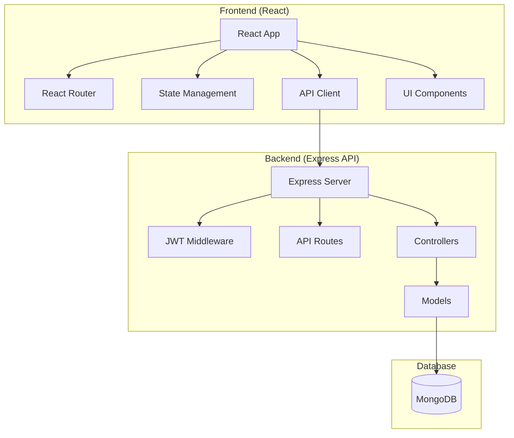

# MERN Conversion Design Document

## Overview

This design outlines the conversion of the existing Taskly application from a server-rendered Express.js application to a modern MERN stack architecture. The conversion will create a clear separation between frontend and backend, implementing a RESTful API server and a React-based single-page application while preserving all existing functionality and data structures.

## Architecture

### High-Level Architecture



### Technology Stack

**Frontend:**
- React 18 with functional components and hooks
- React Router v6 for client-side routing
- Axios for HTTP requests
- React Context API for state management
- Material-UI or Bootstrap for UI components
- React Hook Form for form handling

**Backend:**
- Express.js as the API server
- JWT for authentication
- Mongoose for MongoDB interaction
- Express middleware for validation and error handling
- CORS for cross-origin requests
- Helmet for security headers

**Database:**
- MongoDB (existing schemas preserved)
- Mongoose ODM (existing models maintained)

## Components and Interfaces

### Frontend Component Structure

```
src/
├── components/
│   ├── common/
│   │   ├── Header.jsx
│   │   ├── Footer.jsx
│   │   ├── LoadingSpinner.jsx
│   │   └── ErrorMessage.jsx
│   ├── auth/
│   │   ├── LoginForm.jsx
│   │   ├── SignupForm.jsx
│   │   └── ProtectedRoute.jsx
│   ├── user/
│   │   ├── UserProfile.jsx
│   │   ├── UserList.jsx
│   │   ├── UserCard.jsx
│   │   └── EditProfile.jsx
│   ├── task/
│   │   ├── TaskList.jsx
│   │   ├── TaskCard.jsx
│   │   ├── TaskForm.jsx
│   │   └── TaskFilters.jsx
│   └── dashboard/
│       ├── ProductivityStats.jsx
│       └── StatsChart.jsx
├── pages/
│   ├── Home.jsx
│   ├── Login.jsx
│   ├── Signup.jsx
│   ├── Profile.jsx
│   ├── Users.jsx
│   └── About.jsx
├── services/
│   ├── api.js
│   ├── authService.js
│   ├── userService.js
│   └── taskService.js
├── context/
│   ├── AuthContext.jsx
│   └── TaskContext.jsx
├── hooks/
│   ├── useAuth.js
│   ├── useApi.js
│   └── useTasks.js
└── utils/
    ├── constants.js
    ├── helpers.js
    └── validators.js
```

### Backend API Structure

```
backend/
├── routes/
│   ├── auth.js
│   ├── users.js
│   └── tasks.js
├── controllers/
│   ├── authController.js
│   ├── userController.js
│   └── taskController.js
├── middleware/
│   ├── auth.js
│   ├── validation.js
│   └── errorHandler.js
├── models/
│   ├── User.js (existing)
│   └── Task.js (existing)
└── utils/
    ├── jwt.js
    └── helpers.js
```

### API Endpoints Design

#### Authentication Endpoints
- `POST /api/auth/register` - User registration
- `POST /api/auth/login` - User login
- `POST /api/auth/logout` - User logout
- `GET /api/auth/me` - Get current user profile

#### User Management Endpoints
- `GET /api/users` - Get all users (paginated)
- `GET /api/users/:id` - Get user by ID
- `PUT /api/users/:id` - Update user profile
- `DELETE /api/users/:id` - Delete user account

#### Task Management Endpoints
- `GET /api/users/:userId/tasks` - Get user's tasks (paginated)
- `POST /api/users/:userId/tasks` - Create new task
- `GET /api/tasks/:id` - Get task by ID
- `PUT /api/tasks/:id` - Update task
- `DELETE /api/tasks/:id` - Delete task
- `PATCH /api/tasks/:id/complete` - Mark task as complete

#### Analytics Endpoints
- `GET /api/users/:userId/stats` - Get user productivity statistics

## Data Models

### Existing Models (Preserved)

The current Mongoose models will be maintained with minimal changes:

**User Model:**
- Schema remains identical
- Passport-local-mongoose plugin replaced with manual password hashing
- JWT token handling added

**Task Model:**
- Schema remains identical
- All validation rules preserved
- Status calculation logic maintained

### API Response Formats

#### Success Response Format
```json
{
  "success": true,
  "data": {
    // Response data
  },
  "message": "Operation successful"
}
```

#### Error Response Format
```json
{
  "success": false,
  "error": {
    "message": "Error description",
    "code": "ERROR_CODE",
    "details": {}
  }
}
```

#### Pagination Response Format
```json
{
  "success": true,
  "data": {
    "items": [],
    "pagination": {
      "currentPage": 1,
      "totalPages": 5,
      "totalItems": 50,
      "hasNextPage": true,
      "hasPreviousPage": false
    }
  }
}
```

## Error Handling

### Frontend Error Handling
- Global error boundary for React components
- API error interceptors in Axios
- User-friendly error messages
- Retry mechanisms for failed requests
- Loading states during API calls

### Backend Error Handling
- Centralized error handling middleware
- Consistent error response format
- Proper HTTP status codes
- Request validation errors
- Database operation errors
- Authentication/authorization errors

## Testing Strategy

### Frontend Testing
- Unit tests for components using React Testing Library
- Integration tests for user workflows
- API service mocking for isolated testing
- End-to-end tests using Cypress

### Backend Testing
- Unit tests for controllers and services
- Integration tests for API endpoints
- Database operation testing with test database
- Authentication middleware testing

### Test Coverage Goals
- Minimum 80% code coverage for critical paths
- All API endpoints tested
- All React components tested
- User authentication flows tested

## Security Considerations

### Authentication Security
- JWT tokens with appropriate expiration times
- Secure token storage in httpOnly cookies or localStorage
- Password hashing using bcrypt
- Rate limiting on authentication endpoints

### API Security
- CORS configuration for allowed origins
- Input validation and sanitization
- SQL injection prevention (MongoDB injection)
- XSS protection headers
- CSRF protection for state-changing operations

### Data Protection
- Sensitive data encryption
- Secure password reset flows
- User data privacy compliance
- Audit logging for sensitive operations

## Performance Optimization

### Frontend Performance
- Code splitting with React.lazy()
- Memoization of expensive components
- Optimized bundle sizes
- Image optimization and lazy loading
- Caching strategies for API responses

### Backend Performance
- Database query optimization
- Response caching where appropriate
- Compression middleware
- Connection pooling for MongoDB
- Rate limiting to prevent abuse

## Migration Strategy

### Phase 1: Backend API Development
1. Create new Express API server
2. Implement JWT authentication
3. Convert existing controllers to API endpoints
4. Maintain existing database schemas
5. Add comprehensive API testing

### Phase 2: Frontend Development
1. Create React application structure
2. Implement authentication flow
3. Build user management interfaces
4. Develop task management features
5. Add productivity analytics dashboard

### Phase 3: Integration and Testing
1. Connect React frontend to API backend
2. End-to-end testing
3. Performance optimization
4. Security audit
5. User acceptance testing

### Phase 4: Deployment and Migration
1. Deploy API server
2. Deploy React application
3. Database migration (if needed)
4. DNS and routing configuration
5. Monitoring and logging setup

## Deployment Architecture

### Development Environment
- Frontend: React dev server (port 3000)
- Backend: Express server (port 5000)
- Database: Local MongoDB instance

### Production Environment
- Frontend: Static files served by CDN or web server
- Backend: Express server with PM2 process manager
- Database: MongoDB Atlas or self-hosted MongoDB
- Reverse proxy: Nginx for routing and SSL termination

This design maintains all existing functionality while modernizing the architecture for better maintainability, scalability, and user experience.