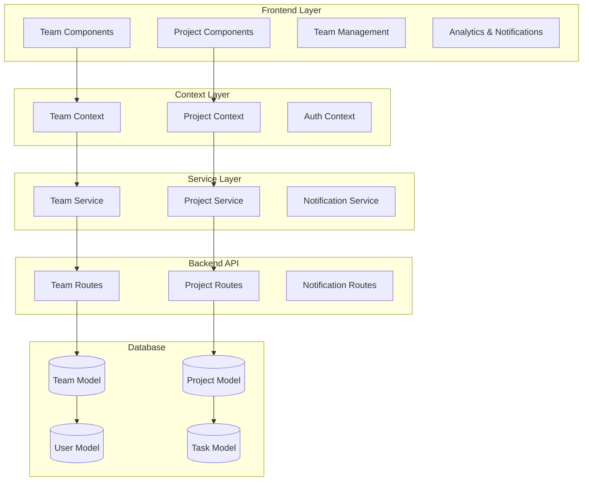

# Team Collaboration Design Document

## Overview

The Team Collaboration feature will extend Taskly's individual task management capabilities to support team-based workflows. This design leverages the existing Team and Project models in the backend while creating a comprehensive frontend interface for team management, project collaboration, and role-based access control.

The system will integrate seamlessly with the existing authentication, task management, and user interface patterns while adding new collaborative capabilities that enhance productivity for teams of all sizes.

## Architecture

### High-Level Architecture



### Component Architecture

The team collaboration system will follow the existing component structure:

- **Pages**: Team dashboard, project views, team settings
- **Components**: Reusable team/project components
- **Context**: Team and project state management
- **Services**: API communication layer
- **Hooks**: Custom hooks for team operations

## Components and Interfaces

### Frontend Components

#### 1. Team Management Components

**TeamDashboard.jsx**
- Main team overview page
- Team statistics and recent activity
- Quick access to projects and members
- Integration with existing DashboardLayout

**TeamList.jsx**
- Display user's teams with search and filtering
- Team creation and join functionality
- Team status indicators and member counts

**TeamCard.jsx**
- Individual team display component
- Team avatar, name, member count, recent activity
- Quick actions (view, settings, leave)

**TeamSettings.jsx**
- Team configuration and member management
- Role assignment and permission management
- Invite code generation and management
- Team deletion and archiving

#### 2. Project Management Components

**ProjectDashboard.jsx**
- Project overview with task statistics
- Project timeline and milestone tracking
- Member activity and contribution metrics

**ProjectList.jsx**
- Display team projects with filtering
- Project creation and management
- Integration with existing task views

**ProjectCard.jsx**
- Individual project display
- Progress indicators and deadline tracking
- Member avatars and quick stats

**ProjectSettings.jsx**
- Project configuration and member assignment
- Project-specific permissions and settings
- Project archiving and deletion

#### 3. Member Management Components

**MemberList.jsx**
- Team/project member display
- Role indicators and permission badges
- Member invitation and removal actions

**MemberCard.jsx**
- Individual member display
- Avatar, role, activity status
- Quick actions for role management

**InviteModal.jsx**
- Team invitation interface
- Invite code sharing and email invitations
- Bulk invitation capabilities

#### 4. Enhanced Task Components

**TaskAssignment.jsx**
- Task assignment to team members
- Project association interface
- Collaborative task features

**TaskComments.jsx**
- Task commenting system
- Real-time comment updates
- Mention functionality for team members

### Backend API Endpoints

#### Team Management Routes (`/api/teams`)

```javascript
// Team CRUD operations
GET    /api/teams                    // Get user's teams
POST   /api/teams                    // Create new team
GET    /api/teams/:teamId            // Get team details
PUT    /api/teams/:teamId            // Update team
DELETE /api/teams/:teamId            // Delete team

// Team member management
GET    /api/teams/:teamId/members    // Get team members
POST   /api/teams/:teamId/members    // Add team member
PUT    /api/teams/:teamId/members/:userId  // Update member role
DELETE /api/teams/:teamId/members/:userId  // Remove member

// Team invitations
POST   /api/teams/:teamId/invite     // Generate invite code
POST   /api/teams/join/:inviteCode   // Join team via invite
DELETE /api/teams/:teamId/invite     // Revoke invite code

// Team statistics
GET    /api/teams/:teamId/stats      // Get team analytics
GET    /api/teams/:teamId/activity   // Get team activity feed
```

#### Project Management Routes (`/api/projects`)

```javascript
// Project CRUD operations
GET    /api/projects                 // Get user's projects
POST   /api/projects                 // Create new project
GET    /api/projects/:projectId      // Get project details
PUT    /api/projects/:projectId      // Update project
DELETE /api/projects/:projectId      // Delete project

// Project member management
GET    /api/projects/:projectId/members    // Get project members
POST   /api/projects/:projectId/members    // Add project member
PUT    /api/projects/:projectId/members/:userId  // Update member role
DELETE /api/projects/:projectId/members/:userId  // Remove member

// Project tasks
GET    /api/projects/:projectId/tasks      // Get project tasks
POST   /api/projects/:projectId/tasks      // Create project task

// Project statistics
GET    /api/projects/:projectId/stats      // Get project analytics
```

### Context Providers

#### TeamContext.jsx

```javascript
const TeamContext = {
  // State
  teams: [],
  currentTeam: null,
  teamMembers: [],
  teamProjects: [],
  teamStats: null,
  isLoading: false,
  error: null,
  
  // Actions
  fetchTeams: () => {},
  createTeam: (teamData) => {},
  updateTeam: (teamId, updates) => {},
  deleteTeam: (teamId) => {},
  joinTeam: (inviteCode) => {},
  leaveTeam: (teamId) => {},
  
  // Member management
  addMember: (teamId, userId, role) => {},
  removeMember: (teamId, userId) => {},
  updateMemberRole: (teamId, userId, role) => {},
  
  // Invitations
  generateInviteCode: (teamId) => {},
  revokeInviteCode: (teamId) => {},
}
```

#### ProjectContext.jsx

```javascript
const ProjectContext = {
  // State
  projects: [],
  currentProject: null,
  projectMembers: [],
  projectTasks: [],
  projectStats: null,
  isLoading: false,
  error: null,
  
  // Actions
  fetchProjects: () => {},
  createProject: (projectData) => {},
  updateProject: (projectId, updates) => {},
  deleteProject: (projectId) => {},
  
  // Member management
  addProjectMember: (projectId, userId, role) => {},
  removeProjectMember: (projectId, userId) => {},
  updateProjectMemberRole: (projectId, userId, role) => {},
  
  // Task management
  createProjectTask: (projectId, taskData) => {},
  assignTask: (taskId, userId) => {},
}
```

## Data Models

### Enhanced User Model Integration

The existing User model already includes team relationships. The frontend will utilize:

```javascript
// User team data structure
user.teams = [{
  teamId: ObjectId,
  role: 'owner' | 'admin' | 'member' | 'viewer',
  joinedAt: Date,
  permissions: ['read', 'create', 'edit', 'delete', 'manage']
}]
```

### Team Data Structure (Frontend)

```javascript
const teamData = {
  _id: String,
  name: String,
  description: String,
  avatar: String,
  owner: {
    _id: String,
    fullname: String,
    username: String,
    avatar: String
  },
  members: [{
    user: {
      _id: String,
      fullname: String,
      username: String,
      avatar: String
    },
    role: String,
    joinedAt: Date,
    permissions: [String],
    status: String
  }],
  settings: {
    visibility: String,
    allowInvites: Boolean,
    defaultRole: String,
    requireApproval: Boolean,
    maxMembers: Number
  },
  stats: {
    totalMembers: Number,
    activeMembers: Number,
    totalProjects: Number,
    completedTasks: Number,
    totalTasks: Number,
    completionRate: Number
  },
  inviteCode: String,
  inviteCodeExpires: Date,
  createdAt: Date,
  updatedAt: Date
}
```

### Project Data Structure (Frontend)

```javascript
const projectData = {
  _id: String,
  name: String,
  description: String,
  color: String,
  icon: String,
  owner: {
    _id: String,
    fullname: String,
    username: String,
    avatar: String
  },
  team: {
    _id: String,
    name: String
  },
  members: [{
    user: {
      _id: String,
      fullname: String,
      username: String,
      avatar: String
    },
    role: String,
    addedAt: Date,
    permissions: [String]
  }],
  status: String,
  startDate: Date,
  endDate: Date,
  deadline: Date,
  stats: {
    totalTasks: Number,
    completedTasks: Number,
    overdueTasks: Number,
    completionRate: Number,
    progress: Number
  },
  tags: [String],
  category: String,
  createdAt: Date,
  updatedAt: Date
}
```

## Error Handling

### Frontend Error Handling

The system will extend the existing error handling patterns:

```javascript
// Team-specific error types
const TEAM_ERRORS = {
  TEAM_NOT_FOUND: 'Team not found',
  INSUFFICIENT_PERMISSIONS: 'Insufficient permissions',
  MEMBER_LIMIT_REACHED: 'Team member limit reached',
  INVALID_INVITE_CODE: 'Invalid or expired invite code',
  ALREADY_MEMBER: 'User is already a team member'
}

// Error handling in components
const handleTeamError = (error) => {
  if (error.response?.status === 403) {
    showError('You do not have permission to perform this action')
  } else if (error.response?.status === 404) {
    showError('Team or resource not found')
  } else {
    showError(error.message || 'An unexpected error occurred')
  }
}
```

### Backend Error Handling

Extend existing error handling middleware for team operations:

```javascript
// Team-specific error responses
const teamErrorHandler = (error, req, res, next) => {
  if (error.name === 'TeamNotFoundError') {
    return res.status(404).json({
      success: false,
      message: 'Team not found',
      code: 'TEAM_NOT_FOUND'
    })
  }
  
  if (error.name === 'InsufficientPermissionsError') {
    return res.status(403).json({
      success: false,
      message: 'Insufficient permissions',
      code: 'INSUFFICIENT_PERMISSIONS'
    })
  }
  
  next(error)
}
```

## Testing Strategy

### Unit Testing

**Frontend Component Tests**
- Team and project component rendering
- User interaction handling
- State management validation
- Error boundary testing

**Backend API Tests**
- Team CRUD operations
- Member management functionality
- Permission validation
- Data integrity checks

### Integration Testing

**Team Workflow Tests**
- Complete team creation and management flow
- Member invitation and role assignment
- Project creation and task assignment
- Cross-team collaboration scenarios

**API Integration Tests**
- Frontend-backend communication
- Authentication and authorization
- Real-time updates and notifications
- Error handling and recovery

### End-to-End Testing

**User Journey Tests**
- Team leader creating and managing teams
- Team member joining and collaborating
- Project manager organizing work
- Multi-user collaboration scenarios

## Performance Considerations

### Frontend Optimization

**Data Fetching**
- Implement pagination for large team/project lists
- Use React Query for caching and background updates
- Lazy load team member details and project data

**Component Optimization**
- Memoize expensive calculations (team stats, progress)
- Use React.memo for frequently re-rendered components
- Implement virtual scrolling for large member lists

**State Management**
- Normalize team and project data structures
- Implement selective updates to prevent unnecessary re-renders
- Use context splitting to avoid over-subscription

### Backend Optimization

**Database Queries**
- Add indexes for team and project queries
- Implement aggregation pipelines for statistics
- Use population selectively to avoid over-fetching

**Caching Strategy**
- Cache team member lists and permissions
- Implement Redis caching for frequently accessed data
- Use database-level caching for team statistics

## Security Considerations

### Authentication and Authorization

**Role-Based Access Control**
- Implement granular permissions for team operations
- Validate user roles before allowing actions
- Secure project access based on team membership

**Data Protection**
- Validate all team and project data inputs
- Sanitize user-generated content (team names, descriptions)
- Implement rate limiting for team operations

**Privacy Controls**
- Respect team visibility settings
- Protect sensitive team information
- Implement audit logging for team changes

### API Security

**Request Validation**
- Validate team and project IDs
- Check user permissions for all operations
- Implement CSRF protection for state-changing operations

**Data Sanitization**
- Sanitize team and project data
- Validate invite codes and expiration
- Prevent injection attacks in search queries

## Migration Strategy

### Database Migration

The Team and Project models already exist in the backend, so no database migration is required. However, we may need to:

1. Add indexes for performance optimization
2. Update existing user documents to include team relationships
3. Create default teams for existing users (optional)

### Frontend Integration

**Gradual Rollout**
1. Implement team context and basic components
2. Add team creation and management features
3. Integrate project management capabilities
4. Enable collaborative task features
5. Add advanced analytics and notifications

**Backward Compatibility**
- Maintain existing individual task workflows
- Ensure non-team users can continue using the app
- Provide migration path for existing tasks to projects

## Monitoring and Analytics

### Team Usage Metrics

**Team Activity Tracking**
- Team creation and growth rates
- Member engagement and activity levels
- Project completion rates and timelines
- Feature adoption and usage patterns

**Performance Monitoring**
- API response times for team operations
- Frontend rendering performance
- Database query performance
- Error rates and user feedback

### User Experience Metrics

**Collaboration Effectiveness**
- Task completion rates in teams vs. individual
- Communication frequency and patterns
- User satisfaction with team features
- Feature usage and adoption rates

This design provides a comprehensive foundation for implementing team collaboration while maintaining consistency with Taskly's existing architecture and user experience patterns.