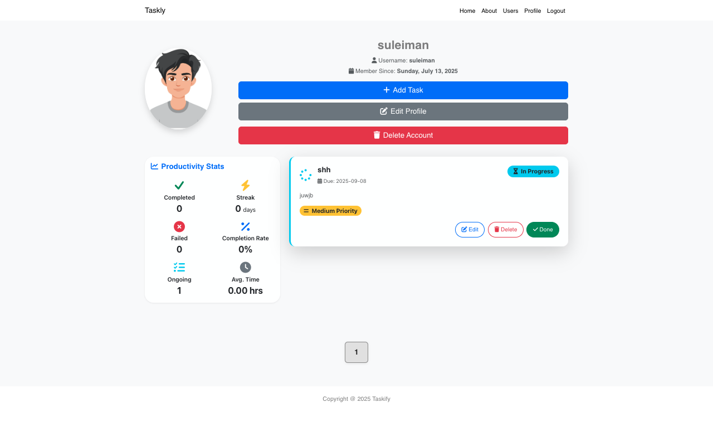

# Taskly

Taskly is a modern, full-featured productivity web app designed to help users manage tasks, track progress, and boost efficiency. Built with Node.js, Express, MongoDB, and EJS, Taskly offers a seamless experience for user and task management, complete with authentication, profile customization, and productivity analytics.

---

## Demo


---

## Demo Gallery

| Home |                  Home                  |                 Home                   |
|:----:|:--------------------------------------:|:--------------------------------------:|
|  |  |  |

| Signup | Login | Profile |
|:------:|:-----:|:-------:|
|  |  |  |

| All Users | Add Task | Edit User |
|:---------:|:--------:|:---------:|
|  |  |  |

---

## Features

- **User Authentication:** Secure registration, login, and logout with Passport.js
- **Profile Management:** Edit user details, upload avatars, and delete accounts
- **Task Management:** Create, edit, complete, and delete tasks
- **Productivity Stats:** Visualize your productivity on the home page
- **Responsive UI:** Beautiful EJS templates styled with Bootstrap
- **Flash Messages:** Instant feedback for user actions
- **Validation:** Robust input validation with Joi
- **RESTful API Structure:** Clean and maintainable routes and controllers
- **Pagination:** Paginated user and task lists for scalability
- **Error Handling:** Friendly error pages and messages
- **Custom Middleware:** For authentication, validation, and error handling

---

## Technologies Used

- **Node.js** — JavaScript runtime
- **Express** — Web framework
- **MongoDB & Mongoose** — Database and ODM
- **EJS** — Templating engine
- **Bootstrap** — Responsive design
- **Passport.js** — Authentication
- **Joi** — Validation

---

## Folder Structure

```
controllers/      # Route handlers for users and tasks
model/            # Mongoose models (User, Task)
routes/           # Express route definitions
views/            # EJS templates for all pages
public/           # Static assets (CSS, JS, images, fonts)
utils/            # Utility functions (error handling, async wrappers)
schemas.js        # Joi validation schemas
middleware.js     # Custom middleware
app.js            # Main Express app
```

---

## Getting Started

1. **Clone the repository:**
   ```bash
   git clone https://github.com/yourusername/taskly.git
   cd taskly
   ```
2. **Install dependencies:**
   ```bash
   npm install
   ```
3. **Set up environment variables:**
   - Create a `.env` file and add your MongoDB URI and session secret:
     ```env
     MONGODB_URI=mongodb://127.0.0.1:27017/taskly
     SESSION_SECRET=yourSecretKey
     ```
4. **Seed the database (optional):**
   ```bash
   node seeds/userSeed.js
   ```
5. **Start the app:**
   ```bash
   npm start
   ```
6. **Visit Taskly in your browser:**
   - Go to [http://localhost:3000](http://localhost:3000)

---

## API Documentation

All form routes render EJS views. Here are the main endpoints:

### Authentication
- `GET /signup` — Render sign-up form
- `POST /` — Register user (`fullname`, `username`, `email`, `password`, `avatar`)
- `GET /login` — Render login form
- `POST /login` — Authenticate (`username`, `password`)
- `GET /logout` — Log out

### User Management
- `GET /users` — List users (paginated)
- `GET /users/:userId` — User profile
- `GET /users/:userId/edit` — Edit user (auth required)
- `PUT /users/:userId` — Update user (auth required)
- `DELETE /users/:userId` — Delete user (auth required)

### User Tasks
- `GET /users/:userId/tasks/new` — Add task form (auth required)
- `POST /users/:userId/tasks` — Create task
- `GET /users/:userId/tasks/:taskId/edit` — Edit task form
- `PUT /users/:userId/tasks/:taskId` — Update task
- `POST /users/:userId/tasks/:taskId` — Mark task complete
- `DELETE /users/:userId/tasks/:taskId` — Delete task

### Home & Info
- `GET /` — Home page with stats
- `GET /about` — About page

---

**Taskly** — Your productivity, organized.
