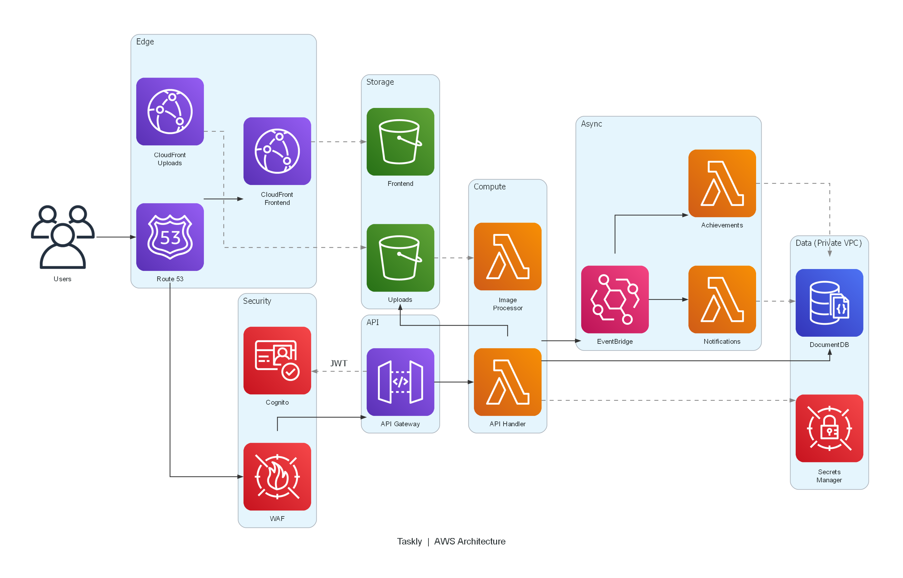
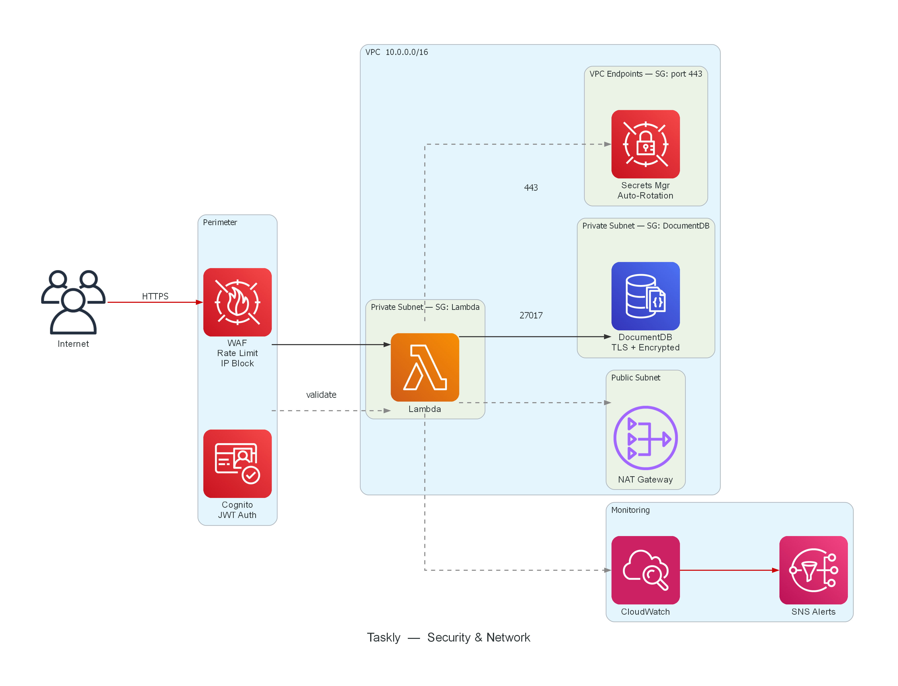
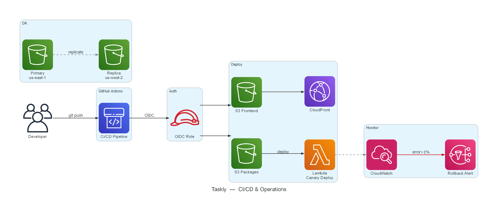

# Taskly

A task and project management app for individuals and small teams. Organize work, track progress, collaborate without the bloat.

Built with React, Express, MongoDB, and deployed on AWS serverless infrastructure.



## What it does

- **Tasks** Create, prioritize, assign, set deadlines, track completion
- **Projects** Group tasks into projects with progress tracking
- **Teams** Invite members, assign roles, collaborate in shared workspaces
- **Calendar** Visualize deadlines and plan ahead
- **Analytics** Productivity stats, completion rates, streaks
- **Notifications** Stay on top of assignments and deadlines

## Tech stack

| Layer | Technology |
|-------|-----------|
| Frontend | React 18, Vite, Tailwind CSS, Framer Motion |
| Backend | Node.js, Express, Mongoose |
| Database | MongoDB (DocumentDB in production) |
| Auth | Session-based (local), Cognito JWT (AWS) |
| Storage | Cloudinary (images), S3 (production) |
| Email | Resend (local), SES (production) |
| Infra | Lambda, API Gateway, CloudFront, VPC, WAF |
| IaC | Terraform (12 modules) |
| CI/CD | GitHub Actions with OIDC |

## Architecture

The app runs locally on Express + MongoDB for development. Production uses AWS serverless:

```
CloudFront → S3 (frontend)
Route 53 → WAF → API Gateway → Lambda (Express) → DocumentDB
                                    ├→ S3 (uploads, pre-signed URLs)
                                    ├→ EventBridge → Lambda processors
                                    ├→ SQS → Lambda (email via SES)
                                    └→ Cognito (JWT validation)
```

Security: VPC with private subnets, security groups, NAT gateway, WAF rate limiting, Secrets Manager with auto-rotation.





## Quick start

### Prerequisites

- Node.js 18+
- MongoDB running locally

### Setup

```bash
# Clone
git clone https://github.com/suletetes/taskly.git
cd taskly

# Backend
cd backend
npm install
cp .env.example .env   # Edit with your values

# Frontend
cd ../frontend
npm install
cp .env.example .env
```

### Run

```bash
# Terminal 1
cd backend && npm run dev

# Terminal 2
cd frontend && npm run dev
```

Open http://localhost:3000

### Seed test data

```bash
cd backend && npm run seed
```

Login with `john@example.com` / `password123`

## Project structure

```
taskly/
├── backend/
│   ├── controllers/        # Route handlers
│   ├── models/             # Mongoose schemas
│   ├── routes/             # API routes
│   ├── middleware/         # Auth, validation, security
│   ├── config/             # Cloudinary, passport, email
│   ├── services/           # Email, events (AWS)
│   ├── lambda/             # Lambda handler + processors
│   ├── utils/              # Helpers, logger, secrets
│   └── tests/              # Unit + integration tests
├── frontend/
│   ├── src/
│   │   ├── components/     # UI components
│   │   ├── context/        # React context (auth, tasks, teams, projects)
│   │   ├── pages/          # Route pages
│   │   ├── services/       # API client layer
│   │   └── hooks/          # Custom hooks
│   └── e2e/                # Playwright tests
├── infrastructure/
│   ├── main.tf             # Root module
│   └── modules/            # vpc, lambda, iam, s3, documentdb, waf, ses, etc.
├── .github/workflows/      # CI/CD pipelines
└── scripts/
    ├── migration/          # Data migration tools
    └── cicd/               # OIDC setup scripts
```

## API endpoints

### Auth
```
POST   /api/auth/register
POST   /api/auth/login
POST   /api/auth/logout
GET    /api/auth/profile
```

### Tasks
```
POST   /api/users/:userId/tasks
GET    /api/users/:userId/tasks
PUT    /api/tasks/:id
DELETE /api/tasks/:id
```

### Teams
```
GET    /api/teams
POST   /api/teams
GET    /api/teams/:id
PUT    /api/teams/:id
DELETE /api/teams/:id
POST   /api/teams/:id/members
POST   /api/teams/join/:inviteCode
```

### Projects
```
GET    /api/projects
POST   /api/projects
GET    /api/projects/:id
PUT    /api/projects/:id
DELETE /api/projects/:id
GET    /api/projects/:id/tasks
GET    /api/projects/:id/stats
```

### Other
```
GET    /api/health
POST   /api/upload/avatar
GET    /api/calendar
GET    /api/search
GET    /api/notifications
```

## Environment variables

### Backend (`backend/.env`)

```env
NODE_ENV=development
PORT=5000
MONGODB_URI=mongodb://localhost:27017/taskly
SESSION_SECRET=your-secret-key
CLIENT_URL=http://localhost:3000
CLOUDINARY_CLOUD_NAME=your-cloud-name
CLOUDINARY_API_KEY=your-api-key
CLOUDINARY_API_SECRET=your-api-secret
```

### Frontend (`frontend/.env`)

```env
VITE_API_URL=http://localhost:5000/api
```

## Infrastructure (AWS)

The `infrastructure/` directory contains Terraform modules for full AWS deployment:

| Module | Resources |
|--------|-----------|
| `vpc` | VPC, subnets (public/private), NAT GW, security groups |
| `lambda` | API handler, image processor, email processor |
| `iam` | Lambda execution role, least-privilege policies |
| `api-gateway` | HTTP API, Lambda integration, CORS |
| `documentdb` | Cluster, instances, subnet group |
| `s3` | Frontend bucket, uploads bucket, lifecycle rules |
| `cloudfront` | CDN distributions for frontend and uploads |
| `waf` | Rate limiting, IP reputation, SQL injection rules |
| `ses` | Email sending, domain verification |
| `secrets` | Secrets Manager with KMS encryption |
| `monitoring` | CloudWatch alarms, dashboards, SNS alerts |
| `disaster-recovery` | Cross-region replication, DNS failover |

Deploy:
```bash
cd infrastructure
terraform init
terraform plan -var="environment=prod" -var="documentdb_master_password=xxx" -var="jwt_signing_key=xxx"
terraform apply
```

## CI/CD

Four GitHub Actions workflows:

- **backend-deploy.yml** Lint → Test → Package → Canary deploy to Lambda
- **frontend-deploy.yml** Build → S3 sync → CloudFront invalidation
- **infrastructure-deploy.yml** Terraform plan → apply
- **pr-validation.yml** Lint + test on pull requests

Requires GitHub OIDC setup (see `scripts/cicd/setup-oidc.sh`).

## Development

```bash
# Run backend tests
cd backend && npm test

# Run frontend tests
cd frontend && npm test

# Lint
cd backend && npm run lint
cd frontend && npm run lint
```

## Author

**Suleiman Abdulkadir** [GitHub](https://github.com/suletetes)
```bash
# Backend
cd backend
npm run lint

# Frontend
cd frontend
npm run lint
```

### Database Management

```bash
# Seed database
cd backend
npm run seed

# Clear database
npm run db:clear

# Create indexes
npm run db:indexes
```

## Production Deployment

### Backend Deployment

See [backend/README.md](./backend/README.md) for detailed backend deployment instructions.

**Quick steps:**

1. Set production environment variables
2. Use MongoDB Atlas or managed MongoDB
3. Deploy to your hosting platform (Heroku, AWS, DigitalOcean, etc.)
4. Use PM2 for process management
5. Configure Nginx as reverse proxy

### Frontend Deployment

See [frontend/README.md](./frontend/README.md) for detailed frontend deployment instructions.

**Quick steps:**

1. Build the application: `npm run build`
2. Deploy to static hosting (Vercel, Netlify, etc.)
3. Or serve with Nginx/Apache
4. Configure environment variables
5. Set up SSL certificate

### Docker Deployment

```bash
# Build and run with Docker Compose
docker-compose up -d

# View logs
docker-compose logs -f

# Stop services
docker-compose down
```

## Environment Variables

### Backend Required Variables

| Variable | Description | Example |
|----------|-------------|---------|
| `NODE_ENV` | Environment | `production` |
| `PORT` | Server port | `5000` |
| `MONGODB_URI` | MongoDB connection string | `mongodb://localhost:27017/taskly` |
| `SESSION_SECRET` | Session secret key | `random-secret-key` |
| `FRONTEND_URL` | Frontend URL for CORS | `https://yourdomain.com` |
| `CLOUDINARY_CLOUD_NAME` | Cloudinary cloud name | `your-cloud` |
| `CLOUDINARY_API_KEY` | Cloudinary API key | `123456789` |
| `CLOUDINARY_API_SECRET` | Cloudinary API secret | `secret` |
| `RESEND_API_KEY` | Resend API key | `re_xxx` |
| `EMAIL_FROM` | From email address | `noreply@yourdomain.com` |

### Frontend Required Variables

| Variable | Description | Example |
|----------|-------------|---------|
| `VITE_API_URL` | Backend API URL | `https://api.yourdomain.com/api` |

## Security

- Session-based authentication with secure cookies
- Password hashing with bcrypt
- CORS protection
- Rate limiting on API endpoints
- Input validation and sanitization
- XSS protection
- CSRF protection
- Secure headers with helmet
- Environment variable protection

## Performance

- Code splitting and lazy loading
- Image optimization with Cloudinary
- Database indexing
- API response caching
- Gzip compression
- CDN for static assets
- Optimized bundle size

## Browser Support

- Chrome (last 2 versions)
- Firefox (last 2 versions)
- Safari (last 2 versions)
- Edge (last 2 versions)
- Mobile browsers (iOS Safari, Chrome Mobile)

## Contributing

1. Fork the repository
2. Create your feature branch (`git checkout -b feature/AmazingFeature`)
3. Commit your changes (`git commit -m 'Add some AmazingFeature'`)
4. Push to the branch (`git push origin feature/AmazingFeature`)
5. Open a Pull Request

## Troubleshooting

### Common Issues

**Database connection failed**
- Ensure MongoDB is running
- Check connection string in `.env`
- Verify network connectivity

**CORS errors**
- Check `FRONTEND_URL` in backend `.env`
- Verify frontend is running on correct port
- Check CORS configuration in `server.js`

**Session not persisting**
- Verify `SESSION_SECRET` is set
- Check MongoDB connection for session store
- Clear browser cookies

**File upload fails**
- Verify Cloudinary credentials
- Check file size limits
- Ensure proper MIME types

For more troubleshooting, see:
- [Backend README](./backend/README.md)
- [Frontend README](./frontend/README.md)


## Authors

- Suleiman Abdulkadir

## Links

- [API Documentation](./API_DOCUMENTATION.md)
